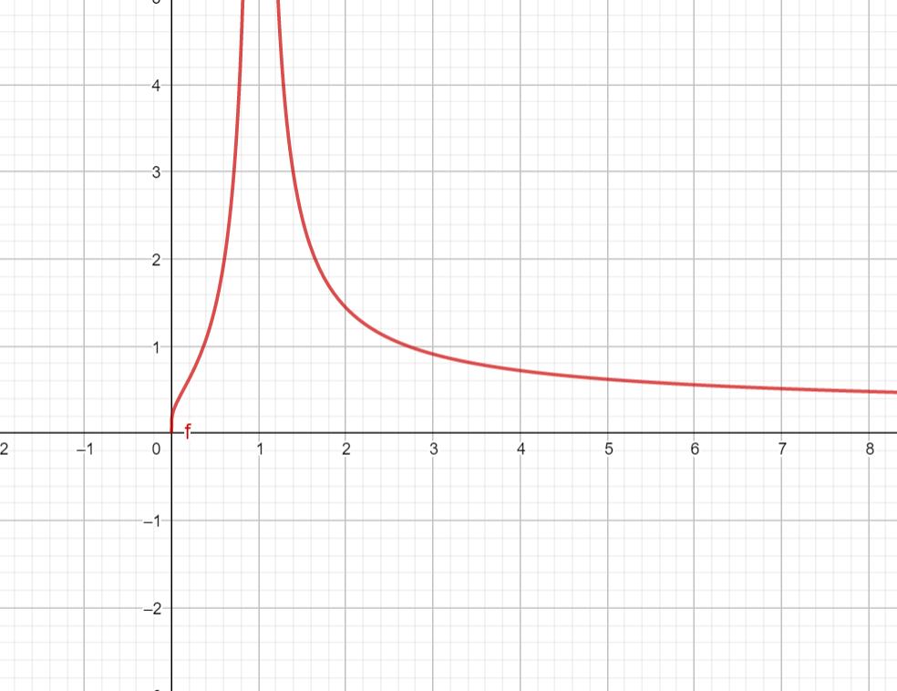
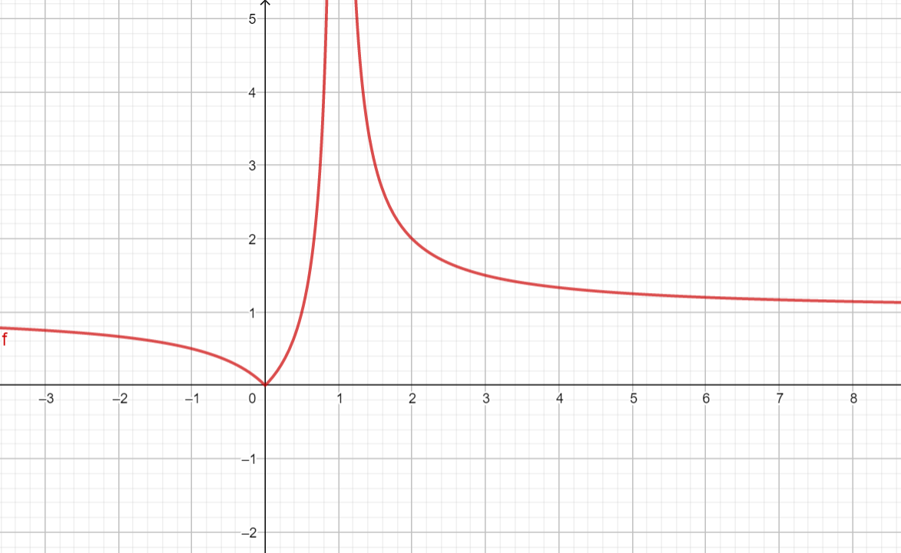
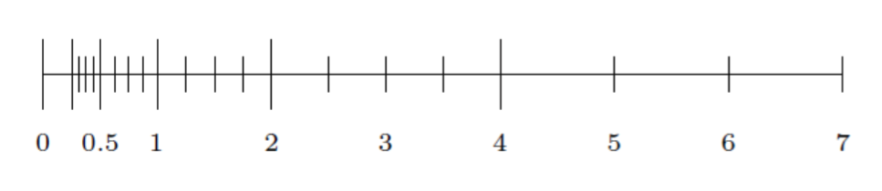
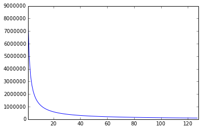

**Arranger** Hocky Yudhiono
**Credits** Pak Raja, (Myself), The internet, and some other unmentioned people.

## Nomor 1

### Forward and Backward Error

- Forward error ialah dengan langsung membandingkan exact solution atau true solution dengan hasil komputasi. Misal, menghitung $\sqrt{9}$, Pada komputer misal dihasilkan $3.1$, error nya ialah selisih $3$ dengan $3.1$. Di lapangan, exact atau true solution ini tidak tersedia, maka kita hampir tidak bisa menggunakan forward error ini.
- Backward error ialah dengan mensubstitusikan hasil komputasi kepada problem. Misal, $3.1^2$, ialah $9.61$, sejauh mana dia bisa memenuhi jawaban dari problemnya. Errornya ialah selisih $9$ dengan $9.61$. Ketidakterpenuhan pada problem.

## Nomor 2

```C++
#include <bits/stdc++.h>
using namespace std;
typedef long double LD;
LD getPos(LD a){
    return a * log(a);
}

int main(){
    LD x = 2;
    LD kiri = 1;
    LD kanan = 3;
    for(int i = 1;i <= 50;i++){
        LD mid = (kiri + kanan) / 2.0;
        if(getPos(mid) <= log(x)) kiri = mid;
        else kanan = mid;
    }
    cout << kiri << endl;
}
```

Dari hasil tersebut didapatkan bahwa nilai $x_1$ lebih dekat dengan hasil akhir. Maka $1.56$ seharusnya lebih dekat dengan jawaban. Kita bisa hitung juga backward error wise, bahwa error dari $1.56$ lebih kecil. Jadi lebih baik menggunakan $1.56$.

```python
>>> math.log(1.56) * 1.56
0.6937098811678554
>>> math.exp(0.6937098811678554)
2.0011257179071924
>>> math.log(1.5601) * 1.5601
0.6938543529550412
>>> math.exp(0.6938543529550412)
2.001414845000893
```

## Nomor 6

Carilah rumus untuk condition number dari fungsi-fungsi berikut dan tentukan nilai-nilai $x$ yang berpotensi membuat fungsi ini sensitif terhadap *error input*:

- Pembagian $f(x) = \frac{1}{x}$, $f'(x) = -\frac{1}{x^2}$.
- Penjumlahan atau pengurangan $f(x) = x + c$, dengan $c$ adalah sebuah konstanta.
- Pemangkatan $f(x) = x^c$, dengan $c$ adalah sebuah konstanta, $f'(x) =  \frac{c e^{c \ln(x)}}{x} = \frac{cx^c}{x}$.
- $f(x) = e^x$, $f'(x) = e^x$.
- $f(x) = \ln(x); f'(x) = \frac{1}{x}$

Hitung $\kappa = |\frac{x \cdot f'(x)}{f(x)} |$,

- $\kappa = 1$ bagus, perlu dicek apakah $x = 0$. (Tidak sensitif terhadap input)
- $f'(x) = 1$, $\kappa = |\frac{x}{x + c}|$ (Sensitif saat $x$ mendekati $-c$)
- $\kappa = |\frac{cx^c}{x^c}| = |c|$ (Sensitif saat c besar)
- $\kappa = |x|$, (Sensitif saat $x$ besar);
- $\kappa = |\frac{1}{\ln(x)}|$



Bisakah kita mencari nilai "Sensitif" $c$ tersebut dengan menghitung $\lim_{x\to c}\kappa = \infty$, pak?

## Nomor 7

Diketahui $f(x) = 1 - x$, ingin dihitung $f(0.9)$, tersimpan $\hat{x} = 0.901$ memiliki 3 angka penting. Relative error pada masukan $x$ ialah $|\frac{x - \hat{x}}{x}| = \frac{0.001}{0.9} = 1.1111 \times 10^{-3}$ Relative error pada keluarannya ialah $|\frac{0.1 - 0.099}{0.1}| = 10^{-2}$ Condition numbernya ialah $\kappa = |\frac{x}{x-1}|$ dia akan sensitif dengan nilai yang mendekati 1, karena limitnya menuju $\infty$ ialah $1$, maka semakin besar bilangannya dia aproksimasi amplifikasinya semakin baik(?). $\kappa_{f(0.9)} = |\frac{0.9}{0.1}| = 9$, teramplifikasi $9$ kali, bila dilihat, $\kappa \approx \frac{\delta_{output}}{\delta_{input}} = 9$, wah sama,

> gg gaming kata ilham

## Nomor 9

$0.1 \rightarrow 0.2 \rightarrow 0.4 \rightarrow 0.8 \rightarrow 1.6 = 0.6 \rightarrow 1.2 = 0.2 \rightarrow 0.4$

$0.0\overline{0011}$

## Nomor 10

Sign: $0$

Exponent: $-4$ = $1019$ = $011\ 1111\ 1011$

Mantissa: `1001 1001 1001 1001 1001 1001 1001 1001 1001 1001 1001 1001 1010` (Dibulatin ke atas karena ujungnya `11`)

```octave
num2hex(0.1)
ans = 3fb999999999999a
```

`0 011 1111 1011   1001100110011001100110011001100110011001100110011010`

## Nomor 15 

So how many “normal” non-zero numbers are there between $0$ and $1$? The negative exponents range from $-1$ all the way to $-126$. In each case, we have $2^{23}$ distinct floating-point numbers because the mantissa is made of $23$ bits. So we have $126 \times 2^{23}$ normal floating-point numbers in $[0,1)$. If you don’t have a calculator handy, that’s $1\,056\,964\,608$. If we want to add the number $1$, that $126 \times 223 + 1$ or $1\,056\,964\,609$.

Half of the floating point is represented in $(-1, 1)$.

Referensi Bacaan:

- https://matthew-brett.github.io/teaching/floating_error.html
- https://blog.demofox.org/2017/11/21/floating-point-precision/
- https://randomascii.wordpress.com/category/floating-point/
- https://docs.oracle.com/cd/E19957-01/806-3568/ncg_goldberg.html#10061

Secara intuitif kita ketahui bahwa bilangan yang secara diskret dapat direpresentasikan dalam IEEE-754 ialah sampai $2^{M + 1}$ saja, setelah itu maka absolute error nya akan lebih tinggi, artinya selisih satu bilangan dengan bilangan lainnya bisa $> 1$. Namun semakin kecil bilangannya, dia akan memiliki akurasi yang lebih tinggi, karena tidak perlu menyimpan bilangan bilangan yang most significant. 

A float has 23 bits of mantissa, and 2^23 is 8,388,608. 23 bits let you store all 6 digit numbers or lower, and most of the 7 digit numbers. This means that floating point numbers have between 6 and 7 digits of precision, regardless of exponent.

The problematic number expressed in base-2 scientific notation, it is about 1.275 * 2^61. At that range very few integers can be expressed – the gap between representable numbers is 512. Here are three relevant numbers:

- 2,940,078,943,461,317,278 – the number the bug filer wanted to store
- 2,940,078,943,461,317,120 – the closest double to that number (smaller)
- 2,940,078,943,461,317,632 – the next closest double to that number (larger)




$$
\begin{array}{c|c|c|c|c} exponent & range & half & float & double \\ \hline 0 & [1,2) & 0.0009765625 & 0.00000011920929 & 0.0000000000000002220446 \\ 1 & [2,4) & 0.001953125 & 0.000000238418579 & 0.00000000000000044408921 \\ 2 & [4,8) & 0.00390625 & 0.000000476837158 & 0.00000000000000088817842 \\ 9 & [512, 1024) & 0.5 & 0.00006103515 & 0.00000000000011368684 \\ 10 & [1024,2048) & 1 & 0.00012207031 & 0.00000000000022737368 \\ 11 & [2048,4096) & 2 & 0.00024414062 & 0.00000000000045474735 \\ 12 & [4096,8192) & 4 & 0.00048828125 & 0.0000000000009094947 \\ 15 & [32768, 65536) & 32 & 0.00390625 & 0.0000000000072759576 \\ 16 & [65536, 131072) & N/A & 0.0078125 & 0.0000000000014551915 \\ 17 & [131072, 262144) & N/A & 0.015625 & 0.00000000002910383 \\ 18 & [262144, 524288) & N/A & 0.03125 & 0.000000000058207661 \\ 19 & [524288, 1048576) & N/A & 0.0625 & 0.00000000011641532 \\ 23 & [8388608,16777216) & N/A & 1 & 0.00000000186264515 \\ 52 & [4503599627370496, 9007199254740992) & N/A & 536870912 & 1 \\ \end{array} 
$$


## Nomor 16

$$
x_{1,2} = \frac{-b \pm \sqrt{b^2-4ac}}{2a} = \frac{-b}{2a}\pm\frac{\sqrt{(b + \sqrt{4ac})(b - \sqrt{4ac})}}{2a} = \frac{-b}{2a}\pm\frac{\sqrt{b + \sqrt{4ac}}\sqrt{b - \sqrt{4ac}}}{2a}
$$

Ingin dicari kedua akar dari persamaan $x^2 + 9^{12}x - 3 = 0$, didapat $a = 1; b = 9^{12}; c = -3$

Karena diketahui bahwa $D$ dekat sekali dengan $-b$, maka akan dicari akar pertama yang nilai absolutnya besar.
$$
x_1 = \frac{-b}{2a} - \frac{\sqrt{b + \sqrt{4ac}}\sqrt{b - \sqrt{4ac}}}{2a} \approx-282429536481.0000
$$

$$
x_2 = \frac{c}{x_1} \approx 0.00000000001062211848 = 1.062211848 \times 10^{-11}
$$

Sumber bacaan:

- https://math.stackexchange.com/questions/866331/numerically-stable-algorithm-for-solving-the-quadratic-equation-when-a-is-very

The previous answers correctly identify that there are two quadratic formulas, and that each has a different range of numeric stability; however, they miss the other subtle instabilities.

**To recap**: the standard quadratic formula,
$$
\begin{align*} x=\frac{-b\pm\sqrt{b^2-4\,a\,c}}{2\,a}, \end{align*}
$$
is not unique. A second formula can be generated by multiplying the numerator and denominator by the "conjugate" of the numerator, i.e., 

$$
\begin{align*} x&=\frac{-b\pm\sqrt{b^2-4\,a\,c}}{2\,a}\times\frac{-b\mp\sqrt{b^2-4\,a\,c}}{-b\mp\sqrt{b^2-4\,a\,c}}= \frac{2\,c}{-b\mp\sqrt{b^2-4\,a\,c}}, \end{align*}
$$

where $\mp=-(\pm)$. These two expressions are _analytically_ equivalent; however, each is _numerically_ unstable for certain values of the coefficients.

The instability discussed by the other posts is if the term, $4\,a\,c$, is small compared to $b^2$ _and_ the sign of the radical term and $b$ are the same, then [catastropic cancellation](https://math.stackexchange.com/questions/1920525/why-is-catastrophic-cancellation-called-so) occurs.

```c++
// Author: Hocky Yudhiono
#include <bits/stdc++.h>
using namespace std;
typedef long double LD;
typedef pair<LD, LD> PLD;
#define fi first
#define se second

PLD roots(LD b, LD c){
    LD x = -12.0L;
    LD D1 = sqrtl(b + x);
    LD D2 = sqrtl(b - x);
    cout << D1 << " " << D2 << endl;
    LD ans = -b * 0.5L;
    LD Dpart = D1 * 0.5L * D2;
    return {c/(ans - Dpart), ans - Dpart};
}

int main(){
    cout << fixed << setprecision(50);
    PLD ans = roots(pow(9.0L, 12.0L), -3.0L);
    cout << ans.fi << " " << ans.se << endl;
}
```

This is stolen from stack exchange:

Fortunately, the two quadratic formulas have opposite signs on the radical term for the same roots, thus it is possible to avoid catastrophic cancellation by selecting the stable form. I.e.,
$$
\begin{align*} x_1 &= \frac{-b-{\rm sign}(b)\sqrt{b^2-4\,a\,c}}{2a}& x_2 = \frac{c}{a\,x_1} \end{align*}
$$

For completeness, there are at least three other numerical instabilities in this formula:

1.  **When $a=0$**: thus the equation is linear and has _at most_ one root given by $-c/b$. It should be noted that if $b=0$ as well, the equation is actually $c=0$ and leaves $x$ undefined/unconstrained!
2.  **When $a\neq0$ and $c=0$**: thus one root is at $x=0$. In this case, the second form of the quadratic equation will yield a NaN ($0/0$) for the second root. It is best therefore to determine the second root by factoring out the root at zero to give $-b/a$.
3.  **Overflow**: the floating point representation might over/under-flow during calculation and this is most critical for the $b$ coefficient. Defining $\mathcal{R}_{max}$ as the largest representable floating point number ($\approx1.8\times10^{308}$ for double precision) then $b^2$ will overflow to infinity at $|b|>\sqrt{\mathcal{R}_{max}}$ according to the IEEE 754 specification (which is "only" $\approx1.304\times10^{154}$). You might not define this as an instability, more an out of range error, but I think the reduced upper range of $b$ is surprising and certainly caught me out!
4.  **??**: I'm pretty sure I've missed some more, floating point arithmetic can be very subtle.

I have written a compile-time algebra library and you can take a look at my implementation of the [quadratic formula](https://github.com/toastedcrumpets/stator/blob/f68de3ea091f21bbe6e36feab4e53bdf2ace868d/stator/symbolic/polynomial.hpp#L1053). Below it is a "more-stable" implementation of the cubic formula, shamelessly stolen from D. Herbison-Evans. For higher-order polynomials I rely on bisection techniques based around Budan's theorem which isn't nearly as difficult to make stable!

The LEAST number of significant figures in any number of the problem determines the number of significant figures in the answer. (You are now looking at **the entire number**, not just the decimal portion)

*This means you have to be able to recognize significant figures in order to use this rule*