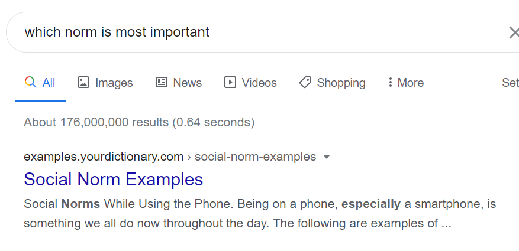

**Arranger** Hocky Yudhiono
**Credits** Pak Raja, (Myself), The internet, and some other unmentioned people.

## Catatan Week 

https://learn.lboro.ac.uk/archive/olmp/olmp_resources/pages/workbooks_1_50_jan2008/Workbook30/30_4_mtrx_norms.pdf

Tidak ada standar khusus untuk norm mana yang digunakan. Benar bahwa $||u||_p \ge ||u||_{p + 1}$.

https://people.eecs.berkeley.edu/~wkahan/MathH110/NormOvrv.pdf

<strike>The most used norm is social norm.</strike>



Di Octave, untuk solve persamaan linear bisa langsung

```octave
x = A \ b;
display(Ax - b)
```

Untuk titik dua mesti dispesifikasi, ujung-ujungnya.

## Nomor 1

```octave
n = 4;
A = rand(n, n); U = triu(A); b = rand(n, 1); x = zeros(n, 1);
x(n) = b(n)/U(n, n);
for i = (n - 1):-1:1
    x(i) = b(i) - U(i, i+1:n) * x(i+1:n);
    x(i) /= U(i, i);
end
display(U); display(b); display(x);
% Compute error for U*x - b = 0
v = U*x - b;
er = norm(v, Inf)
display(er);
% Values vary from 0 to 2e-15
```

## Nomor 2

```octave
n = 4;
A = rand(n, n); b = rand(n, 1); x = zeros(n, 1);

% n = 2
% A = [1, 1; -3, 1]; b = [6; 2]; x = zeros(n, 1);
% x = 1, y = 5

augmented = [A, b];
display(augmented);
for i=1:n
  for j=i+1:n
    m = augmented(j,i)/augmented(i,i);
    augmented(j, i) = 0;
    for k=(i+1):(n+1)
      augmented(j, k) -= m * augmented(i, k);
    endfor
  endfor
endfor

U = augmented; U(:,n+1) = [];
display(augmented);
display(U); 
btilde = augmented; btilde(:,1:n) = []
display(btilde);
x(n) = btilde(n)/U(n, n);
for i = (n - 1):-1:1
    x(i) = btilde(i) - U(i, i+1:n) * x(i+1:n);
    x(i) /= U(i, i);
end

display(x)
% Compute error for A*x - b = 0
v = A*x - b;
er = norm(v, Inf)
display(er);
```

## Nomor 1b

FLOPS operation (menyelesaikan $Ux = b$)

- Setiap looping $i$ ada satu kali pembagian. Total pembagian ada $n$ kali.
- Setiap looping $i$ ada perkalian dua vektor dengan ukuran $n-i$, maka ada $\sum_{i = 1}^{n-1} (n-i) = n(n-1) - \frac{n(n-1)}{2} = \frac{n(n-1)}{2}$ perkalian.
- Ada pula pengurangan sebanyak $n - 1$ kali.

FLOPS operation (melakukan reduksi dengan Gaussian Elimination)

- Pembagian untuk mencari $m$ ada $\sum_{i = 1}^n \sum_{j = i+1}^{n} 1 = \frac{n(n-1)}{2}$.
- Perkaliannya memiliki lapisan $\frac{(n + 1)(n)(n-1)}{3}$ kali. Generating Function ftw
- Pengurangannya juga sama $\frac{(n + 1)(n)(n-1)}{3}$ kali. Generating Function ftw

In C, an operation is the effect of an operator on an expression. Specific to floating-point numbers, a floating-point operation is any mathematical operation (such as +, -, *, /) or assignment that involves floating-point numbers (as opposed to binary integer operations).

Floating-point numbers have decimal points in them. The number 2.0 is a floating-point number because it has a decimal in it. The number 2 (without a decimal point) is a binary integer.

Floating-point operations involve floating-point numbers and typically take longer to execute than simple binary integer operations. For this reason, most embedded applications avoid wide-spread usage of floating-point math in favor of faster, smaller integer operations.

## Nomor 2b

$$
\begin{bmatrix}
0 & 1\\
1 & 0
\end{bmatrix}
=
\begin{bmatrix}
p & 0\\
q & r
\end{bmatrix}
\begin{bmatrix}
s & t\\
0 & u
\end{bmatrix}
$$

Dibuat 4 buah persamaan:

- $p\cdot s = 0$
- $p \cdot t = 1$
- $q \cdot s = 1$
- $q \cdot t + r \cdot u = 0$

Berdasarkan persamaan $2$ dan $3$, diketahui bahwa $p, t, q, s \ne 0$. Kontradiksi dengan pernyataan pertama, yaitu $p \cdot s = 0$.

## Nomor 3b


a) Hasilnya ialah matriks $A$ dengan baris $1$ dan $4$ ditukar

b) 

```octave
A = eye(4)
B = eye(4)
A([1 2],:) = A([2 1],:)
B([2 3],:) = B([3 2],:)
% Berbeda A dan B
```

```octave
octave:5> A([1 2],:) = A([2 1],:)
A =

   0   1   0   0
   1   0   0   0
   0   0   1   0
   0   0   0   1

octave:6> B([2 3],:) = B([3 2],:)
B =

   1   0   0   0
   0   0   1   0
   0   1   0   0
   0   0   0   1

octave:7> A * B
ans =

   0   0   1   0
   1   0   0   0
   0   1   0   0
   0   0   0   1

octave:8> B * A
ans =

   0   1   0   0
   0   0   1   0
   1   0   0   0
   0   0   0   1
```

c) Matriks $A$ disebut simetris bila $A = A^\intercal$, atau $A_{i,j} = A_{j,i}$ untuk setiap $i,j$. Pada matriks $P_{i,j}$ pada awalnya matriks tersebut simetris, kemudian $r_i \leftrightarrow r_j$, sehingga $A_{i,j} = A_{j,i} = 1$, kesimetrisan tetap terjaga.

d) Matriks $P_{i,j}$ ialah matriks elementer dan karena matriks tersebut merupakan matriks ortogonal dan simetris, maka $P_{i,j} = P^{-1}_{i,j} = P^{T}_{i,j}$. Didapatkan $P_{i,j}^2 = I$. Pada dasarnya matriks tersebut merupakan matriks tukar baris, yang merupakan operasi pertukaran baris $i$ dan $j$ secara intuitif, diketahui bahwa dengan menukar baris yang sama $2$ kali akan mengembalikannya ke matriks awal. 

e) $Q^{-1} =\begin{bmatrix}0 & 0 & 0 & 1\\
0 & 0 & 1 & 0\\
1 & 0 & 0 & 0\\
0 & 1 & 0 & 0\\\end{bmatrix}$ Kalau ada beberapa operasi, kerjakan dari kanan, karena matriks elementer paling kanan ialah identitas.
$$
(AB)^{-1} = B^{-1}A^{-1}\\
\textbf{Proof}\\
(B^{-1}A^{-1})(AB) = I \implies B^{-1}A^{-1} = (AB)^{-1}\\
$$
f) $AP_{i,j} = AP_{i,j}^\intercal = (P_{i,j} A^\intercal)^\intercal$. Perhatikan bahwa karena transposnya sama, hal tersebut berlaku, jadi intinya dilakukan transpos pada $A$, kini kolom menjadi baris dan baris menjadi kolom, kemudian dilakukan tukar baris, setelah itu ditranspos lagi, berarti akan terjadi operasi tukar kolom.

## Nomor 4

a) Dengan asumsi $A_{1, 1} \ne 0$, maka matriks tersebut akan melakukan salah satu iterasi pertama dari operasi Gaussian Eliminiation, yaitu dengan menjadikan baris-baris di bawah baris pertama memiliki entri di kolom pertamanya $0$. Secara formal, $A_k := A_k - m_k \cdot A_1$. Perhatikan bahwa $R_{i,j}(c)$ menyatakan salah satu operasi baris elementer yaitu mengurangi suatu baris dengan kelipatan skalar dari baris lain.

b) Tidak berpengaruh, karena setiap operasinya independen terhadap baris berbeda yang dipengaruhinya.
$$
Q =
\begin{bmatrix}
1 & 0 & 0 & 0\\
0 & 1 & 0 & 0\\
0 & 0 & 1 & 0\\
-c & 0 & 0 & 1\\
\end{bmatrix}
\begin{bmatrix}
1 & 0 & 0 & 0\\
0 & 1 & 0 & 0\\
-b & 0 & 1 & 0\\
0 & 0 & 0 & 1\\
\end{bmatrix}
\begin{bmatrix}
1 & 0 & 0 & 0\\
-a & 1 & 0 & 0\\
0 & 0 & 1 & 0\\
0 & 0 & 0 & 1\\
\end{bmatrix}
=
\begin{bmatrix}
1 & 0 & 0 & 0\\
-a & 1 & 0 & 0\\
-b & 0 & 1 & 0\\
-c & 0 & 0 & 1\\
\end{bmatrix}
$$
c) Perhatikan bahwa $R_{i,j}(c)$ merupakan sebuah matriks elementer. Invers dari fungsi tersebut ialah dengan mengurangi baris $j$ dengan baris $i$ dengan kelipatan lawan $c$, yaitu $-c$, sehingga $R_{i,j}^{-1}(c) = R_{i,j}(-c)$. Didapat $R_{i,j}(c)R_{i,j}(-c) = I$.

d)
$$
Q^{-1} =
R_{1,2}^{-1}(-a) R_{1,3}^{-1}(-b) R_{1,4}^{-1}(-c)
=
\begin{bmatrix}
1 & 0 & 0 & 0\\
a & 1 & 0 & 0\\
b & 0 & 1 & 0\\
c & 0 & 0 & 1\\
\end{bmatrix}
$$
e) $P_{2,3}QP_{2,3}, P_{2,4}QP_{2,4}P_{3,4}QP_{4,3}$ 

```octave
P = eye(4); P([2 3],:) = P([3 2],:);
Q = eye(4); Q(2, 1) = -2; Q(3,1) = -3; Q(4,1) = -4 % Dimisalkan biar gampang
display(P * Q * P)

octave:14> display(P * Q * P)
   1   0   0   0
  -3   1   0   0
  -2   0   1   0
  -4   0   0   1
 
 % Terjadi tukar baris 2 dan 3, tapi diagonal utamanya tetap. Setelah dicoba ke yang lain, juga sama
```

$$
\begin{bmatrix}
1 & 0 & 0 & 0\\
-a & 1 & 0 & 0\\
-b & 0 & 1 & 0\\
-c & 0 & 0 & 1\\
\end{bmatrix}
\implies
\begin{bmatrix}
1 & 0 & 0 & 0\\
-b & 0 & 1 & 0\\
-a & 1 & 0 & 0\\
-c & 0 & 0 & 1\\
\end{bmatrix}
\implies
\begin{bmatrix}
1 & 0 & 0 & 0\\
-b & 1 & 0 & 0\\
-a & 0 & 1 & 0\\
-c & 0 & 0 & 1\\
\end{bmatrix}
$$

Hal ini terjadi karena pada operasi pertamanya akan dilakukan operasi tukar baris seperti biasa, kemudian dilakukan operasi tukar kolom. Karena kolom yang bersesuaian hanya bernilai 1 pada diagonal utama lama, maka akan dikembalikan kondisi awalnya.