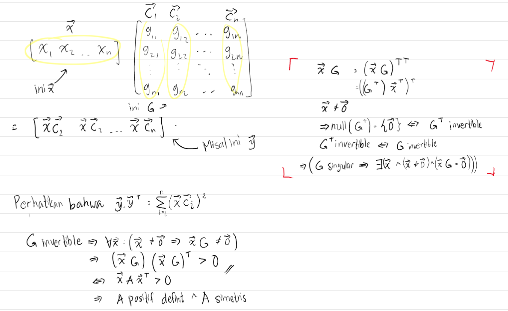
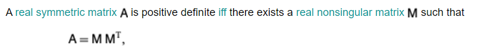

**Arranger** Hocky Yudhiono
**Credits** Pak Raja, Machffud, (Myself), The internet, and some other unmentioned people.

## Nomor 1 

```matlab
function [L, U, p] = LUwPivot(A)

  [n, n] = size(A);

  % initialize lower triangle matrix
  L = eye(n);
  p = 1:n;
  
  for k=1:n-1
    % Find row l, where l has the largest value
    [m, l] = max(abs(A(k:n, k)));
    % Adjust max indexing
    l += (k - 1);
    % swap l-th row and k-th row
    tmp = A(l, :);
    A(l, :) = A(k, :);
    A(k, :) = tmp;
    % swap p vector as well
    tmp = p(l);
    p(l) = p(k);
    p(k) = tmp;
    % Swap l-th row and k-th row of L
    % Swap processed row only
    tmp = L(l, 1:k-1);
    L(l, 1:k-1) = L(k, 1:k-1);
    L(k, 1:k-1) = tmp;
    for i=k+1:n
      % Find m untuk setiap baris i
      L(i, k) = A(i,k)/A(k, k);  
      % Eliminasi baris i untuk kolom k + 1 .. n
      A(i,:) = A(i,:) - L(i, k) * A(k,:);
    endfor
  endfor
  U = A;
  % P = zeros(n, n);
  % for i=1:n
  %  P(i, p(i)) = 1
  % endfor
endfunction
```

Memori $O(n^2)$, banyak operasi flops?

Untuk flopsnya tergantung implementasi pak, pada loop terdalamnya. Tadi Prof. Chan menyampaikan bila dibongkar `A(i,:) = A(i,:) - L(i, k) * A(k,:);` nya (Tidak keseluruhan baris), maka ada $\frac{(n-1)(n)(2n-1)}{6}$ flops. Sama untuk kedua partial pivoting maupun tidak.

## Nomor 2

```octave
octave:3> [L U P] = lu(A)
L =

   1   0   0   0
  -1   1   0   0
  -1  -1   1   0
  -1  -1  -1   1

U =

   1   0   0   1
   0   1   0   2
   0   0   1   4
   0   0   0   8

P =

Permutation Matrix

   1   0   0   0
   0   1   0   0
   0   0   1   0
   0   0   0   1
```

## Nomor 3a

$A\vec{x} = \vec{b}$ dijadikan $L(U\vec{x}) = \vec{b}$.

Misalkan $L\vec{y} = \vec{b}$, maka $\vec{y}$ ialah penyelesaian dari persamaan tersebut dan berlaku: $\vec{y} = L^{-1}\vec{b}$, cari nilai $\vec{y}$ dengan Forward substitution, kemudian kerjakan bagian dalamnya yaitu $U\vec{x} = \vec{y}$. Perhatikan bahwa  $L(U\vec{x}) = \vec{b}$ tadi memiliki solusi untuk $\vec{y}$ yang merupakan vektor yang memenuhi persamaan $L\vec{y} = \vec{b}$, makanya selanjutnya akan dikerjakan $U\vec{x} = \vec{y}$, dan carilah solusinya dengan backward substitution.

```matlab
1;

function x = backward_sub(U, b)
  % This solves Ux = b
  [n n] = size(U);
  x = zeros(n, 1);
  x(n) = b(n)/U(n, n);
  for i = (n - 1):-1:1
    x(i) = b(i) - U(i, i+1:n) * x(i+1:n);
    x(i) /= U(i, i);
  endfor  
  x;
endfunction

function x = forward_sub(L, b)
  % This solves Lx = b
  [n n] = size(L);
  x = zeros(n, 1);
  x(1) = b(1)/L(1, 1);
  for i = 2:n
    x(i) = b(i) - L(i, 1:i) * x(1:i);
    x(i) /= L(i, i);
  endfor
  display(x);
endfunction


L = [1,0,0;2,1,0;3,4,1];
U = [6,5,4;0,3,1;0,0,1];
b = [5;9;12];

y = forward_sub(L, b);
display(y);
x = backward_sub(U, y);
display(x);
```

## Nomor 3b

Perhatikan bahwa $P^{-1} = P^\intercal$. Maka $P^{-1}LUx = b \iff LUx = Pb$

```matlab
function x = solve_LUX(L, U, b)
  y = forward_sub(L, b);
  x = backward_sub(U, y);
  x;
endfunction

%%
% L = [1,0,0;2,1,0;3,4,1];
% U = [6,5,4;0,3,1;0,0,1];
% b = [5;9;12];

%%

L = [1,0,0;1,1,0;0.5,0,1];
U = [2,4,7;0,-2,-7;0,0,-0.5];
P = [0,1,0;0,0,1;1,0,0];
b = [1;2;4];

bb = P * b;
x = solve_LUX(L, U, bb);
display(x);
```

## Nomor 3c

$PAQ = LU$, solve for $A\vec{x} = \vec{b} \iff P^{-1}LUQ^{-1}\vec{x} = \vec{b}$ 

## Nomor 4

Buktikan bahwa $LDL^\intercal$ merupakan matriks simetris. Jika elemen diagonal $D$ semuanya positif buktikan bahwa $LDL^\intercal$ juga matriks positif definit.

$LDL^{T} = L^TD^TL = L^TDL \iff LDL^T\text{ simetris}$


Perhatikan bahwa harus dibuktikan $xLDL^\intercal x^\intercal > 0$

Kita buat sebuah matriks $S = \sqrt{D}$ ialah matriks diagonal yang entri diagonalnya ialah akar dari entri pada matriks $D$. Selanjutnya perhatikan bahwa $S = S^\intercal$ dan berlaku $SS = D$. Tentunya $S$ juga merupakan matriks diagonal positif.

Didapatkan bahwa $\vec{x}LSS^\intercal L^\intercal \vec{x}^\intercal = \vec{x}LS(\vec{x}LS)^\intercal$. Misalkan $LS = G$, maka akan diselesaikan permasalahan pengecekan definit positif dari $\vec{x}G(\vec{x}G)^\intercal$.

Selanjutnya soal ini akan direduce menjadi soal nomor 5 yang sudah pernah diselesaikan. Untuk tambahan, $LS$ mesti invertible. syaratnya agar invertible ialah $L$ juga invertible. Pada matriks segitiga bawah, determinannya ialah perkalian dari entri di diagonal utamanya, yang mengimplikasikan elemen pada diagonal utamanya tidak boleh $0$. Sehingga itu juga harus menjadi syarat dari permasalahan ini. 

## Nomor 5

Jika $G$ matriks segitiga bawah dan definit positif, buktikan $GG^\intercal$ matriks yang simetris dan definit positif. $GG^T = (GG^T)^T=  G^TG$.


$$
G =
\begin{bmatrix}
g_{1,1} & 0 & \dots & 0\\
g_{2,1} & g_{2,2} & \dots & 0\\
\vdots & \vdots & \ddots & \vdots\\
g_{n,1} & g_{n,2} & \dots & g_{n,n}\\
\end{bmatrix}
$$

$$
GG^T =
\begin{bmatrix}
g_{1,1}^2 & g_{2,1}g_{1,1} & \dots & g_{n,1}g_{1,1}\\
g_{2,1}g_{1,1} & g_{2,1}^2+g_{2,2}^2 & \dots & g_{n,1}g_{2,1}+g_{n,2}g_{2,2}\\
\vdots & \vdots & \ddots & \vdots\\

g_{n,1}g_{1,1}& g_{n,1}g_{2,1}+g_{n,2}g_{2,2} & \dots & \sum_{i=1}^n g_{n,i}^2\\
\end{bmatrix}
$$

Asumsikan matriks $G$ invertible, artinya $GG^{-1} = I$

Harus dicari tahu apakah untuk semua vektor $\vec{x}$ tak nol, haruslah benar bahwa $xAx^\intercal > 0$. Perhatikan bahwa disini $\vec{x}$ ialah vektor baris, $\vec{x}{G}$ itu juga matriks baris.

Substitusikan $A = GG^\intercal$ akibatnya $xGG^{\intercal}x^\intercal = (xG)(xG)^T$

Katakan $\vec{x}G = \vec{y}$, maka $yy^\intercal > 0 \iff \sum_{i = 1}^ny_i^2 > 0$ .



Perhatikan bahwa penting fakta bahwa ruang null ialah himpunan semua x dengan $A\vec{x} = \vec{0}$, untuk suatu matriks $A$.

Bonus:



## Nomor 6

$$
GG^\intercal =
\begin{bmatrix}
a^2 & ab\\
ab & b^2+c^2
\end{bmatrix}\\
a = 2; b = 3; c = 1;\\
G =
\begin{bmatrix}
2 & 0\\
3 & 1\\
\end{bmatrix}\\
$$

$$
HH^T =
\begin{bmatrix}
a^2 & ab & ad\\
ab & b^2+c^2 & bd + ce\\
ad & bd + ce & d^2 + e^2+f^2\\
\end{bmatrix}\\
a = 2;\\
b = 1;\\
d = -1;\\
c = 1;\\
e = 0;\\
f = 1;\\
H = \begin{bmatrix}
2\\
1 & 1\\
-1 & 0 & 1 \\
\end{bmatrix}\\
$$

```octave
octave:40> H = [4,2,-2;2,2,-1;-2,-1,2]
H =

   4   2  -2
   2   2  -1
  -2  -1   2
```

```octave
H = [4,2,-2;2,2,-1;-2,-1,2];
disp(chol(H)');
G = [4, 6; 6, 10];
disp(chol(G)');
```

https://en.wikipedia.org/wiki/Cholesky_decomposition

## Nomor 7

$$
\text{cond}(A) = ||A||\cdot||A^{-1}||\\
$$

https://www.netlib.org/lapack/lug/node75.html

```octave
A = [1,1;1,1.001];
b = [2;2];
bt = [2;2.001];
% A
nrm = inf;
ans = norm(bt - b,nrm)/norm(b,nrm);
disp(ans);
% 5.0000e-04
% B
x = A \ b;
xt = A \ bt;
ans = norm(xt - x, nrm)/norm(x, nrm);
disp(ans);
% 0.5000
% C
normA = norm(A, nrm);
normAi = norm(inv(A), nrm);
disp(normA * normAi);
% 4004.0, really ill
```

