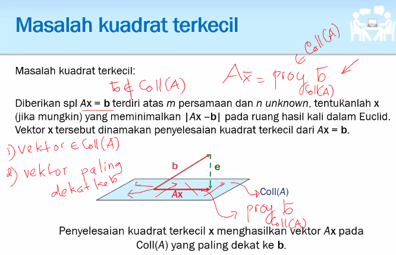

## Nomor 1

```octave
1;
function x = backwardSub(U, b)
  % This solves Ux = b, U is unit upper triangular matrix
  [n n] = size(U); x = zeros(n, 1); x(n) = b(n);
  for i = (n - 1):-1:1
    x(i) = b(i) - U(i, i+1:n) * x(i+1:n);
  endfor
endfunction

function x = forwardSub(L, b)
  % This solves Lx = b, L is unit lower triangular matrix
  [n n] = size(L);  x = zeros(n, 1);  x(1) = b(1);
  for i = 2:n
    x(i) = b(i) - L(i, 1:i-1) * x(1:i-1);
  endfor
endfunction

function x = diagSub(D, b)
  % This solves Dx = b, D is a diagonal matrix
  [n n] = size(D);  x = zeros(n, 1);
  for i = 1:n
    x(i) = b(i)/D(i, i);
  endfor
endfunction

function [A] = getSymmetric(n)
  % Generate a symmetric matrix with uniform distribution
  A = zeros(n, n);
  for i=1:n
    for j=1:n
      A(i, j) = rand();
      if(i > j)
        A(i, j) = A(j, i);
      endif
    endfor
  endfor
endfunction

function [L D] = LDLT(A)
   % Input: A, symmetric matrices
   % Output L and D such that A = L D L'
   [n n] = size(A);
   L = zeros(n, n);
   D = zeros(n);
   for k=1:n
     D(k) = A(k, k) - sum(L(k,1:k-1).^2.*D(1:k-1));
     for i=1:n
       % Cari pembaginya
       L(i, k) = (A(i, k) - sum(L(i, 1:k-1).*L(k, 1:k-1).*D(1:k-1)))/D(k);
     endfor
   endfor
   D = D(1:n,1);
endfunction

function [L D P] = LDLTwP(A)
   % Input: A, symmetric matrices
   % Output L and D such that A = L D L'
   [n n] = size(A);
   p = 1:n;
   L = zeros(n, n);
   D = zeros(n);
   for k=1:n
     % Extract maximum diagonal of submatrix k .. n : k .. n
     [M pos] = max(diag(A(k:n,k:n)))
     % p is the relative position
     pos += k - 1;
     
     % Swap pos and k
     tmp = p(pos);
     p(pos) = p(k);
     p(k) = tmp;
     
     % Swap Diagonal p and k
     tmp = A(pos,1:n)
     A(pos, 1:n) = A(k, 1:n);
     A(k, 1:n) = tmp;
     
     tmp = A(1:n, pos);
     A(1:n, pos) = A(1:n, k);
     A(1:n, k) = tmp;
     
     % Swap Diagonal p and k
     tmp = L(pos,1:n)
     L(pos, 1:n) = L(k, 1:n);
     L(k, 1:n) = tmp;
     
     tmp = L(1:n, pos);
     L(1:n, pos) = L(1:n, k);
     L(1:n, k) = tmp;
     
     D(k) = A(k, k) - sum(L(k,1:k-1).^2.*D(1:k-1));
     for i=1:n
       % Cari pembaginya
       L(i, k) = (A(i, k) - sum(L(i, 1:k-1).*L(k, 1:k-1).*D(1:k-1)))/D(k);
     endfor
   endfor
   D = D(1:n,1);
   
   
   P = zeros(n, n);
   for i=1:n
     P(i, p(i)) = 1
   endfor
   
endfunction

function [x] = solve(A, b)
  [L D P] = LDLTwP(A);
  disp(L);
  disp(D);
  disp(P);
  disp(L * diag(D) * L');
  disp(P * A * P');
  b = P * b;
  z = forwardSub(L, b);
  y = diagSub(diag(D), z);
  w = backwardSub(L', y);
  x = P' * w;
endfunction

A = [1, 2, 3, 4; 2, 5, 6, 7; 3, 6, 8, 9; 4, 7 , 9, 0];
b = [4; 1; 5; 8];

A = getSymmetric(3);
b = rand(3, 1);
disp(solve(A, b));
disp(A\b);
```

Jika kita diberikan persamaan $Ax = b$, dan diketahui dekomposisi $A = LDL^\intercal$, maka bisa kita tuliskan $LDL^\intercal x = b$. Pertama, kita akan menyelesaikan dari bagian terluarnya.

- Carilah $z$ sehingga $Lz = b$. Perhatikan bahwa disini $DL^\intercal x = z$.
- Carilah $y$ sehingga $Dy = z$. Perhatikan bahwa disini $L^\intercal x = y$.
- Carilah $x$ sehingga $L^\intercal x = y$. Perhatikan bahwa $x$ adalah solusi yang kita inginkan.

Perhatikan bahwa $L$ ialah matriks **unit segitiga bawah**, artinya entri pada diagonal utamanya berisi satu, kita bisa buat fungsi backward dan forward substitution untuk $L$ dan $L^\intercal$.

```octave
function x = backwardSub(U, b)
  % This solves Ux = b, U is unit upper triangular matrix
  [n n] = size(U); x = zeros(n, 1); x(n) = b(n);
  for i = (n - 1):-1:1
    x(i) = b(i) - U(i, i+1:n) * x(i+1:n);
  endfor
endfunction

function x = forwardSub(L, b)
  % This solves Lx = b, L is unit lower triangular matrix
  [n n] = size(L);  x = zeros(n, 1);  x(1) = b(1);
  for i = 2:n
    x(i) = b(i) - L(i, 1:i) * x(1:i);
  endfor
endfunction

function x = diagSub(D, b)
  % This solves Dx = b, D is a diagonal matrix
  [n n] = size(D);  x = zeros(n, 1);
  for i = 1:n
    x(i) = b(i)/D(i, i);
  endfor
endfunction
```

Bagaimana kasusnya untuk $PAP^{\intercal} = LDL^\intercal$? Pertama secara intuitif bisa kita tuliskan $A = P^{-1}LDL^\intercal (P^\intercal)^{-1}$. Perhatikan bahwa $PP^\intercal = I \iff P^\intercal = P^{-1}$.
$$
\textbf{Proof}\\
(PP^\intercal)_{ij} =
\begin{cases}
1 & P_{ik} \and P^\intercal_{kj} \iff i = j\\
0 &\text{otherwise}\\
\end{cases}
$$
Akan kita selesaikan persamaan sebagai berikut.
$$
\begin{aligned}
P^{-1}LDL^\intercal (P^\intercal)^{-1}x &= b\\
LDL^\intercal (P^\intercal)^{-1}x &= Pb\\
LDL^\intercal (P^\intercal)^{\intercal}x &= Pb\\
LDL^\intercal Px &= Pb
\end{aligned}
$$
Untuk kemudahan komputasi, lakukan $b := Pb$

- Carilah $z$ sehingga $Lz = b$. Perhatikan bahwa disini $DL^\intercal Px = z$.
- Carilah $y$ sehingga $Dy = z$. Perhatikan bahwa disini $L^\intercal Px = y$.
- Carilah $w$ sehingga $L^\intercal w = y$. Perhatikan bahwa disini $Px = w$.
- Carilah $x$ sehingga $x = P^\intercal w$.

Total Flops:

- $LDL' = \frac{n^3}{3}$ (Setengah dari $LU$)
- Backward substitution = Forward Substitution = $\frac{n(n-1)}{2}$.
- Diagonal = $n$.
- Perkalian matriks permutasi (Kasus diagonal pivoting) $n^3$ (?)

## Nomor 2

```octave
2;
function [A] = getBanded(n, p, q)
  A = zeros(n, n);
  for j=1:n
    for i=max(j-p, 1):min(j+q, n)
      A(i,j) = rand();
    endfor
  endfor
endfunction

function [A] = getBanded2(n, p, q)
  A = rand(n, n);
  for i=1:n
    for j=1:n
      if(j > i + p)
        A(i,j) = 0;
      endif
      if(i > j + q)
        A(i,j) = 0;
      endif
    endfor
  endfor
endfunction

function [L U] = LU(A, p, q)
  [n n] = size(A);
  L = eye(n);
  % Looping setiap kolom
  for k=1:n-1
    % Untuk baris ke bawahnya
    for i=k+1:min(k+q, n)
      % Hitung L nya
      L(i, k) = A(i, k)/A(k,k);
      A(i, k) = 0;
      % Lakukan pengurangan untuk baris ke-i
      for j=k+1:min(k+p, n)
        % Sampai k + p saja, karena kanan sisanya sudah 0
        A(i, j) -= L(i, k) * A(k, j);
      endfor
    endfor
  endfor
  U = A;
endfunction

n = 6; p = 2; q = 3;
A = getBanded2(n, p, q);
disp(A);
[L U] = LU(A, p, q);
disp(L); disp(U);
disp(L * U - A);
```


Operasi perhitungan $L$ pembagian di awal akan dilakukan sebanyak sekitar $(n - q - 1) q + \sum_{i = 1}^qi = \frac{2q(n - q - 1) + q(q+1)}{2} = \frac{q(2n - q - 1)}{2}$.

Operasi perkalian dan pengurangannya di bawah itu masing-masing ada sekitar $(n- q -1) \min(p,q)^2 \sum_{i = 1}^{\min(p, q)}i^2$. Mungkin salah hehe ga tau deh susah ngitungnya. Tapi sekitar segitu lah.

Intinya kompleksitasnya sekitar $n(p+q)^2$

## Nomor 3

### Teorema Konsistensi

Ada SPL biasa (kumpulan persamaan-persamaan linear) , Ax = b (Persamaan Matriks), dan dalam bentuk matriks augmented (Eliminasi gauss jordan [A | b]. Alasan menggunakan matriks:

1. Kita dapat melupakan nama unknown (Namanya tidak berpengaruh)
2. Kita dapat menggunakan operasi-operasi pada matriks yang berlaku dalam SPL, dan menghasilkan matriks lain yang ekuivalen dengan SPL di awal (Solusinya sama)

Ada bentuk keempat penyajian spl, yaitu kombinasi linear kolom kolom.

$x_1\vec{c_1} + x_2\vec{c_1} + \dots + x_n\vec{c_1} = \vec{b}$

Mencari solusi sama dengan mencari nilai $x_1, x_2, \dots, x_n$ sehingga memenuhi persamaan linear tersebut

Ruang kolom ialah himpunan semua kombinasi linear kolom kolom, himpunan semua kombinasi linear didapat dari merentangkan suatu himpunan. Secara optimal dapat merentangkan basis. Artinya semua vektor pada himpunan yang baru dibentuk dapat dinyatakan dalam kombinasi linear kolom-kolom atau Coll dari suatu matriks. Sehingga $x_1\vec{c_1} + x_2\vec{c_1} + \dots + x_n\vec{c_1} = \vec{b}$ akan konsisten, ada nilai vektor **x** nya sehingga memenuhi persamaan tersebut. Artinya apabila vektor **b** berada dalam Coll(A) atau berada dalam ruang kolom A, maka SPL A**x** = **b** konsisten.

Apabila konsisten maka ada solusi.


Sehingga A**x** = **b** konsisten (***jika dan hanya jika***) $\iff$ **b** adalah kombinasi linear kolom-kolom A, atau $b \in \text{Coll}({A})$.

### Ortogonal Komplemen

W adalah subruang dari RHKD V.

Vektor **v** dikatakan ortogonal dengan W jika **v** ortogonal dengan setiap vektor di W.

Himpunan semua vektor yagn ortogonal dengan W adalah subruang ortogonal komplemen dari W, ditulis $W^\perp$ (Dibaca **W perp**). Sifat-sifat ortogonal komplemen.

- $W^\perp$ subruang, dari $V$
  - Benar, bahwa vektor nol anggota $W^\perp$, kemudian perhatikan bahwa tertutup terhadap penjumlahan dan perkalian dengan skalar.
  - 
- $W$ dan $W^\perp$ tidak saling asing, ada vektor nol yang merupakan anggota dari kedua subruang
- $(W^\perp)^\perp = W$ 
- $V^\perp$ ialah {**0**}.
- Jika $W = W^\perp$ maka V = {**0**}.
- $\text{Null}(A^T) \perp \text{Coll}(A)$ dan $\text{Row}(A) \perp \text{Null}(A)$

Perhatikan bahwa ada beberapa cara penyajian SPL:

1. Himpunan persamaan-persamaan Linear
2. Persamaan Matriks
3. Matriks Augmented
4. Kombinasi Linear kolom-kolom A
5. Hasil kali titik baris-baris


Buktikan $\text{Row}(A) \perp \text{Null}(A)$ 


Buktikan bahwa subset satu sama lain.


Perhatikan bahwa Ortogonal komplemen belum tentu komplemen dengan irisan sama dengan 0, mungkin saja ada sebuah vektor pada suatu ruang vektor yang tidak ortogonal dengan keduanya. Misalnya, W = Span({(0, 1)}) dan $W^\perp$ = Span({(1, 0)}), perhatikan bahwa ada vektor **v**  = (1, 1) yang bukan anggota keduanya.

### Melalui Dua Titik

Tentukan gradiennya terlebih dahulu, kemudian cari persamaan y = mx + c yang memenuhi keduanya.

### Melalui Tiga Titik

Akan didapatkan tiga titik, 


Akan diselesaikan SPL:
$$
\begin{bmatrix}
x_1 & 1\\
x_2 & 1\\
x_3 & 1
\end{bmatrix}
\begin{bmatrix}
a\\ b
\end{bmatrix}
=
\begin{bmatrix}
y_1 \\ y_2 \\ y_3
\end{bmatrix} 
$$
Bila ada solusi konsisten, maka, ada solusi yang melewati tiga titik.

Pada LSS kita ingin mencari persamaan garis yang cocok, meskipun tidak konsisten.


Kita ingin mencocokkan kurva pada data. Tidak apa apa tidak kolinear, tapi kita masih ingin mencari garis terbaik yang errornya minimal.

Kita harus mengerti teorema konsistensi dan perp.

Masalah kuadrat terkecil ialah kita diberikan spl A**x** = **b**, kita ingin meminimalkan |A**x**-**b**|, atau jarak euclideannya, makanya jarak kuadrat.

Kita ingin mencari pengganti b yang paling dekat, dan b itu harus berada dalam $\text{Coll}(A)$ dan vektornya harus paling dekat ke **b**, agar errornya minimal. Yang paling dekat ialah **proyeksi ortogonal dari b** di ruang kolom $A$.

Ingin dicari $A\vec{x} = \text{proj}_{\text{Coll(A)}}(\vec{b})$



vektor **e** adalah $\text{proj}_{\text{Coll(A)}}(\vec{b})-\vec{b}$, perhatikan bahwa **e** ortogonal dengan **A**, maka  $\vec{e} \in \text{Null}(A^T)$

maka $\vec{e}$ solusi SPL $A^T\vec{x} = \vec{0}$.


## Nomor 4

Observasi penting dari dot product dua vektor $\vec{u}$ dan $\vec{v}$ ialah $u \cdot v = u^\intercal v$. Perhatikan sifat penting sebagai berikut.
$$
Qu \cdot Qv = u \cdot v = (Qu)^\intercal(Qv) = u^\intercal Q^\intercal Qv = u^\intercal v = u \cdot v
$$
Dari sini, bisa dibawa kepada observasi selanjutnya, bahwa:
$$
||Qx||_2 = \sqrt{Qx\cdot Qx}= \sqrt{x\cdot x} = ||x||_2
$$
Referensi:

- https://sites.math.rutgers.edu/~cherlin/Courses/250/Lectures/250L26.html

Jika $Q_1$ dan $Q_2$ merupakan matriks ortogonal, (pada matriks ortogonal $Q$, berlaku $Q^\intercal = Q^{-1}$ maka $Q_1Q_2Q_2^\intercal Q_1^\intercal = I$, sehingga $Q_1Q_2(Q_1Q_2)^\intercal = I$, sehingga $Q_1Q_2$ ortogonal juga.


Hint : $I$ is symmetric and $uu^{T}$ is symmetric.

Thus it follows,

$I^{T} =I$ and $(uu^{T})^{T}=uu^{T}$ (Recall that $(AB)^{T}=B^{T}A^{T}$ )

Hence $H^{T}=(I-uu^{T}/\beta)^{T}=I^{T}-(uu^T/\beta)^{T}=I-uu^{T}/\beta=H$

Verily , $H $ is symmetric.


$$H = I - \frac {2} {u^T u} u u^T=I+\alpha \ u u^T$$

$$H^T=(I+\alpha \ u u^T)^T=I^T+\alpha \ (uu^T)^T=I+\alpha (u^T)^Tu^T=I+\alpha \ u u^T=H$$

Where I used $I^T=I$ and the [basic properties](http://en.wikipedia.org/wiki/Transpose#Properties) of the transposed matrix, namely:

*   For scalars $\lambda$ we have $(\lambda A)^T=\lambda A^T$
*   $(A+B)^T=A^T+B^T$
*   $(AB)^T=B^TA^T$
*   $(A^T)^T=A$


D:

http://fourier.eng.hmc.edu/e176/lectures/NM/node10.html