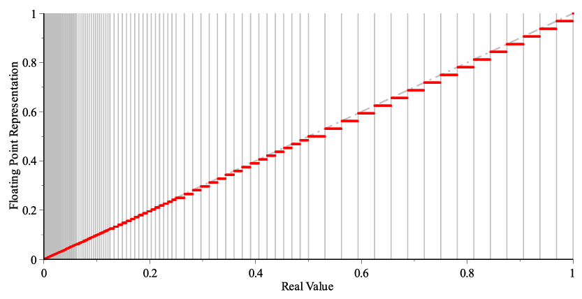

Pada mata kuliah ini akan lebih berfokus kepada komputasi numerik, *issues* seputar floating point.

Ada bahas materi berikut:

- Scientific Computing & Computer Arithmetic
- System of linear equations
- Least Square Problems
- Nonlinear equations
- Optimization
- Interpolation
- Numerical Differentiation and Integration
- Initial Value Problems (IVP)

Kita bahas tentang:

- Bagaimana cara menyelesaikan suatu permasalahan
- Optimisasi
- Aspek *error* dan akurasi.

```c++
#include <bits/stdc++.h>
using namespace std;

int main(){
    double x = 10.0;
    int n = 65;
    for(int i = 1;i <= n;i++) x = sqrt(x);
    for(int i = 1;i <= n;i++) x *= x;
    cout << fixed << setprecision(10);
    cout << x << endl;
}
```

Seharusnya *input* dan *output* sama, yaitu $x = 10$, namun saat $n$ semakin besar, maka nilai tersebut bisa semakin tidak akurat.

- Saat $n = 65$, nilai $x$ sudah menjadi $1$.

Kesimpulan yang bisa didapatkan ialah

- Adanya keterbatasan dalam komputasi.

## IEEE-754

Ada sistem floating point:

- 32-bit Single Precision (`1 - 8 - 23`) (Sign bit - Exponent - Mantissa)
- 32-bit Double Precision (`1 - 11 - 52`)

Form of floating point

- **Normalized** dalam bentuk `1.Mantissa`, ada `1` extra di depan bentuk floating pointnya untuk *gain* 1 extra bit
- **Denormalized** Karena nilainya terlalu kecil, maka dia akan menjadi `0.Mantissa`.

Maximum and over-flow

- Ada nilai terbesar dan terkecil yang kita simpan, jika kita kalikan satu atau kita kalikan dua, dia bisa saja overflow atau underflow.
- Bagian overflow ini state dimana dia tidak bisa dioperasi domainnya udah di luar batas komputasi.



Semakin dekat ke $0$, dia akan semakin padat atau semakin *dense*. Semakin jauh dari $0$, dia akan jadi jarang-jarang. Hindari mengoperasikan bilangan-bilangan besar, kita bisa melakukan scaling.

```c++
#include <bits/stdc++.h>
using namespace std;

int main(){
    // double x = 1.0;
    float x = 1.0;
    int cnt = 0;
    while(x > 0.0){
        cnt++;
        x /= 2.0;
    }
    cout << cnt << endl;
    // Float = 150
    // Double = 16446
}
```

Read references:

- [What you never wanted to know about floating point but will be forced to find out](https://www.volkerschatz.com/science/float.html)

```c++
#include <bits/stdc++.h>
using namespace std;

int main(){
    float x = 1.0; int n = 0;
    while(1.0 + x > 1.0) x /= 2.0, n++;
    cout << n << endl;
}
```

Underflow hubungannya dengan exponent, tapi yang `1 + x > 1` itu hubungannya dengan mantissa, exponentnya tetap, karena dia selalu menjaganya di 1, selalu normalized. Dia ada arithmetic plus itu, penambahan itu ada batas buat kapan dia diperhitungkan di komputer. Batas itu kita sebut sebagai *machine epsilon* atau *unit round off*, itu adalah batas terkecil bilangan positif yang masih berlaku $1 + \epsilon_m = 1$. Machine epsilon ini sama dengan batas atas relative error dari bilangan float.
$$
\frac{|\hat{x} - x|}{|x|} < \epsilon_m
$$

## Error Analysis

*Rounding error*, bila kita memasukkan $x$ tapi hanya ada $y$ dan $z$, dia bakal rounding. Kalau chopping dia bakal kehilangan $1/2^M$ precision, tapi kalau rounding dia bakal lebih precise. Mesin akan menyajikan bilangan dengan floating-point terdekat, bukan yang terkecil atau yang terbesar kurang atau lebih dari dia. Akibatnya, kita akan memiliki *rounding error*.

Besar error akibat dari rounding terbatas oleh $\epsilon_m$, machine epsilon.
$$
\hat{x} = x(1 + \delta)
$$
Dengan $\delta$ disebut rounding error. Berlaku $|\delta| < \epsilon_m$.

## Sources and Types of Errors

Sources:

- Truncation errors ialah penyederhanaan persamaan matematika, 
- Rounding errors ialah keterbatasan komputer dalam menyimpan bilangan.

Types of errors:

- Absolute = $|\hat{x} - x^*|$, kalau di floating point untuk angka yang besar pasti akan kacau absolute errornya akan lebih besar
- Relative = $\delta = \frac{|\hat{x} - x^*|}{|x^*|} \le \epsilon_{mach} \iff \hat{x} = x^*(1 + \delta)$

## Forward and Backward Error

- Forward error ialah dengan langsung membandingkan exact solution atau true solution dengan hasil komputasi. Misal, menghitung $\sqrt{9}$, Pada komputer misal dihasilkan $3.1$, error nya ialah selisih $3$ dengan $3.1$. Di lapangan, exact atau true solution ini tidak tersedia, maka kita hampir tidak bisa menggunakan forward error ini.
- Backward error ialah dengan mensubstitusikan hasil komputasi kepada problem. Misal, $3.1^2$, ialah $9.61$, sejauh mana dia bisa memenuhi jawaban dari problemnya. Errornya ialah selisih $9$ dengan $9.61$. Ketidakterpenuhan pada problem.
