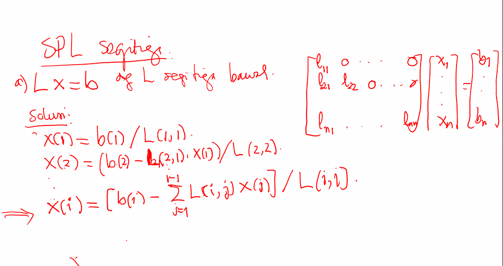
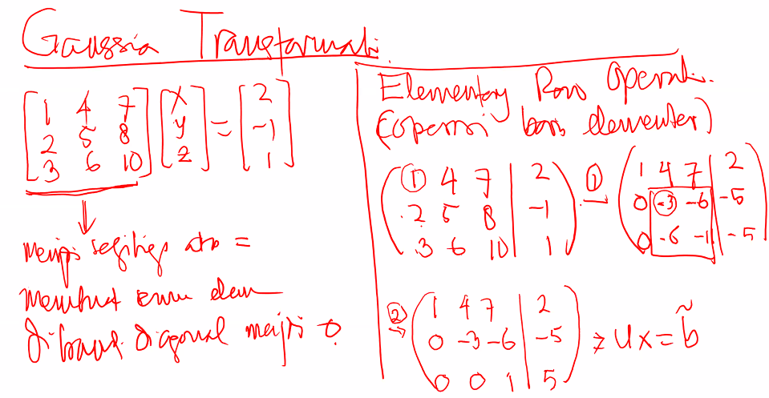
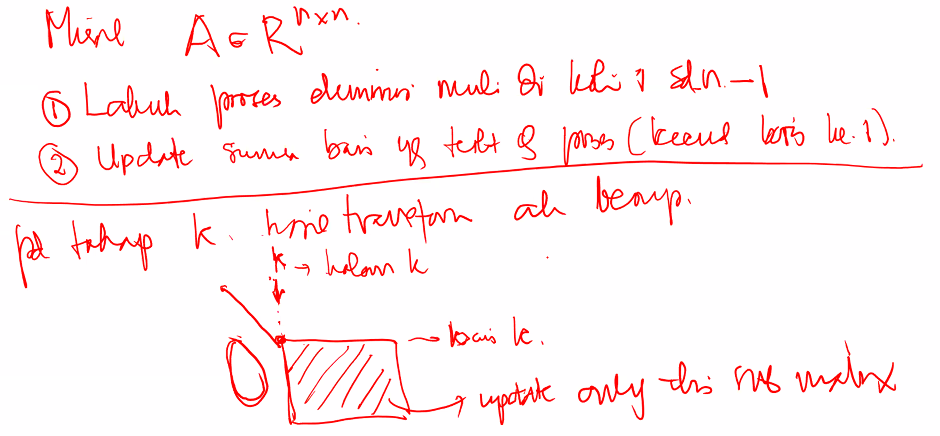
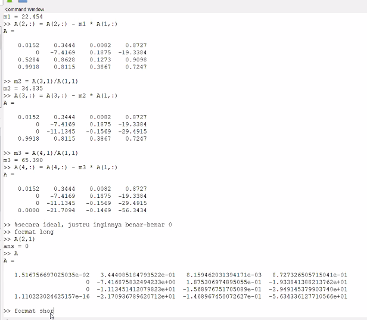

$$
2x + 3y = 1 \\
x - y = 4
$$

Merupakan *square system*.
$$
x - 5y = 7 \\
x + y = 4 \\
2x - y = 1
$$
Merupakan over-determined system
$$
2x - y + z = 4\\
x + y = 2
$$
Merupakan underdetermined system

Semuanya didefinisikan dari banyak persamaan dan banyak variabel atau unknowns.

Jika semua persamaan dinyatakan dalam persamaan matriks $Ax = b$, maka pernyataan-pernyataan berikut ekuivalen

- $det(A) = 0$
- Invertable
- Kolom/baris saling bebas linear

Jika $b$ berada pada ruang ruang yang direntang pada matriks $A$, maka persamaan tersebut memiliki solusi. Tapi belum tentu invertable.

Jika matriks $A$ merupakan matriks diagonal, maka solusi akan mudah dicari. Jika matriks $A$ merupakan matriks segitiga atas, namun masih solvable.

### Definisi

Sebuah matriks diagonal ialah jika $i \ne j \implies a_{i,j} = 0$.

Sebuah matriks segitiga atas ialah jika $i < j \implies a_{i,j} = 0$.

Sebuah matriks segitiga bawah ialah jika $i > j \implies a_{i,j} = 0$.

Teknik menyelesaikan persamaan segitiga atas ialah *back substitution*.

Teknik menyelesaian persamaan segitiga bawah ialah *forward substitution*

Pada matriks-matriks tersebut, Jika ada solusi, semua elemen diagonal utamanya tidak ada yang $0$.

**Proof** Asumsikan diagonal utama ada yang $0$, dan semua variabel setelah atau sebelumnya udah didapat, maka nilai unknown didapatkan jika dan hanya jika koefisiennya non-zero, sehingga bisa dilakukan pembagian untuk mendapatkan nilainya.

**Solusi** dari $Lx = b$ ialah:
$$
xA = LU\\L = \begin{bmatrix}* & 0 & 0 &\dots & 0 \\* & * & 0 &\dots & 0 \\* & * & * &\dots & 0 \\\vdots & \vdots & \vdots &\ddots & \vdots \\* & * & * & \dots & *\end{bmatrix};U = \begin{bmatrix}* & * & * &\dots & * \\0 & * & * &\dots & * \\0 & 0 & * &\dots & * \\\vdots & \vdots & \vdots &\ddots & \vdots \\0 & 0 & 0 & \dots & *\end{bmatrix}
$$

$$
\begin{align}
x_1 &= \frac{b_1}{l_{1,1}}\\
x_2 &= \frac{b_2 - l_{2,1}\cdot x_{1}}{l_{2,2}}\\
\vdots \\
x_i &= \frac{b_i - \sum_{j = 1}^{i - 1}(l_{i,j} \cdot x_j) }{l_{i,i}}\\
\end{align}
$$
FLOPS = Floating Point Operations. Menambahkan dari penjelasan Prof. Chan, di komputasi numerik, tidak semua operasi kita pedulikan; lebih perhatikan operasi-operasi yang namanya "floating point operations" (flops). Contoh yang bukan flops: assignment, swap variable, integer operations, ganti tanda. Contoh yang flops: penjumlahan, perkalian, pangkat melibatkan bilangan riil. Ini karena flops memakan waktu yg sangat signifikan (dealing with 64 bits at one operation). :D
$$
x_i = \frac{b_i - {\sum_{j = i + 1}^{n}(l_{i,j} \cdot x_{j})}}{l_{i,i}}
$$

```octave
n = 4;
A = rand(n, n); U = triu(A); b = rand(n, 1); x = zeros(n, 1);
x(n) = b(n)/U(n, n);
for i = (n - 1):-1:1
    x(i) = b(i) - U(i, i+1:n) * x(i+1:n);
    x(i) /= U(i, i);
end
display(U); display(b); display(x);
% Compute error for U*x - b = 0
v = U*x - b;
er = norm(v, Inf)
display(er);
% Values vary from 0 to 2e-15
```

Untuk menyelesaikan $Ax = b$, dapat dilakukan dengan merubah matrix $A$ menjadi matriks segitiga atas menggunakan Gaussian Elimination. $Ax = b \rightarrow Ux = \tilde{b}$

Jika kita bawa ke matriks identitas, maka disebut Eliminasi Gauss-Jordan, $Ax = b \rightarrow Ix = \tilde{b}$. Namun operasi ini terlalu mahal.

If I have a linear system of equations $Ax=b$ where $A \in \mathbb{R} ^{n\times n}, x \in \mathbb{R} ^{n}, b \in \mathbb{R} ^{n} $ this system can be solved for $x$ via an LU decomposition: $$A = LU$$ where $U \in \mathbb{R} ^{n\times n}$ is upper triangular and $L \in \mathbb{R} ^{n\times n}$ is lower triangular.

I understand a forward substitution is then required where one first solves:

$$Ly=b$$ for $y$.

And then we solve: $$Ux=y$$ for $x$.

I am currently trying to determine the _operation count_ or the FLOPS for each of the forward substitution and backward substitution. I have seen that the correct value is approximately given by $\mathcal{O}(n^{2})$ flops but I am unsure how one can arrive at this value.

I can see that for the backward substitution, for example, the system is represented as:

$$\begin{bmatrix} u_{11} & u_{12} & \cdots & u_{1n} \\ 0 & u_{22} &\cdots &u_{2n} \\ \cdots& \cdots & \ddots &\vdots \\ 0 & 0 & \cdots & u_{nn} \end{bmatrix} \begin{bmatrix} x_{1}\\ x_{2}\\ \vdots \\ x_{n} \end{bmatrix} = \begin{bmatrix} y_{1}\\ y_{2}\\ \vdots \\ y_{n} \end{bmatrix}$$


From which:

$$x_{i} = \frac{1}{u_{ii}} \left ( y_{i} - \sum_{j=i+1}^{n}u_{ij}x_{j} \right ); i = n, ..., 1$$

From an equation like this, how can one identify the approximate operation count?

If your matrix is <span class="math-container">$n\times n$</span> you have the following operations

1.  <span class="math-container">$n$</span> divisions,
2.  <span class="math-container">$\frac{n^2-n}{2}$</span> sums,
3.  <span class="math-container">$\frac{n^2-n}{2}$</span> multiplications.

The number of divisions is clear because you have <span class="math-container">$n$</span> rows. The number of sums and multiplications are <span class="math-container">$\sum_{i=1}^{n-1}n^2=\frac{n^2-n}{2}$</span>. It comes from <span class="math-container">$\sum_{j=1+1}^{n}u_{ij}x_j$</span>.

The total number of operations is <span class="math-container">$2n^2-n=\mathcal{O}(n^2)$</span>


I hope it solves your doubts

>  Maaf pak izin bertanya, untuk penentuan matrix P pada pivot factorization itu kita perlu observasi dulu bentuk yang bagus ya pak?atau bisa dipilih sebarang ya pak? terima kasih pak

Tidak sembarang. Matriks P digunakan untuk merecord operasi "tukar baris" yang dilakukan selama faktorisasi LU (blm dibahas). Operasi tukar baris juga ga sembarang; biasanya kita pilih pivot untuk kolom ke-i adalah $a_{k,i}$ dengan nilai mutlak $|a_{k,i}|$ yg paling besar.
Ttg penjelasan Prof Chan saat ini, ini tanpa pivoting ya.

Elementary Row Operation (Operasi Baris Elementer)

- Mengalikan dengan skalar tidak nol

- Menjumlahkan suatu baris dengan perkalian skalar baris lain

- Tukar baris

  ```
  R[1] = R[1] + R[2]
  R[2] = -R[2]
  R[2] = R[2] + R[1]
  R[1] = R[1] - R[2]
  ```

Dalam menyelesaikan
$$
\begin{bmatrix}
a\\
b\\
c
\end{bmatrix}
$$
Dan melakukan eliminasi, kita harus membuat $b$ dan $c$ menjadi nol. Sementara:

- $a \ne 0$
- $m_1 = \frac{b}{a}$ sehingga baris $b := b - m_1 \cdot a$ 
- $m_2 = \frac{c}{a}$ sehingga baris $c := c - m_2 \cdot a$ 

$$
\begin{bmatrix}
1 & 0 & 0\\
-m_1 & 1 & 0 \\
-m_2 & 0 & 1
\end{bmatrix}
\begin{pmatrix}
a\\
b\\
c\\
\end{pmatrix}
=
\begin{pmatrix}
a\\
b - m_1\cdot a\\
c - m_2\cdot a\\
\end{pmatrix}
=
\begin{pmatrix}
a\\
0\\
0\\
\end{pmatrix}
$$

> maaf paak Saya masih belum mengerti, kalua ini bukan pivoting, yg pivoting seharusnya bagaimana ya? apakah yg harus melakukan row $R_3 \leftrightarrow R_1$?

Operasi tukar baris (seperti $R_3 \leftrightarrow R_1$) merupakan bagian dari langkah yg dilakukan dalam pivoting. Pivoting, sebelum melakukan operasi tukar baris, harus menentukan dulu, mau tukar baris apa dengan apa; kalau udah tahu mau tukar yg mana, baru deh lakukan operasi tukar baris seperti  $R_3 \leftrightarrow R_1$.

Ringkasnya, pivoting = strategi pilih pivot + operasi tukar baris/kolom. 

Nanti ada beberapa macam pivot: partial pivoting, full pivoting, dll tergantung cara dia pilih pivotnya.







```octave
for i=1:n-1
	% Kita jadikan diagonal A(i,i) sebagai pusat pembagian
	for j=i+1:n
		m = A(j,i)/A(i,i)
		A(j,:) = A(j,:) - m * A(i,:)
	endfor
endfor

for i=1:n-1
	% Kita jadikan diagonal A(i,i) sebagai pusat pembagian
	for j=i+1:n
		m = A(j,i)/A(i,i)
		A(j, i) = 0
		for k=i+1:n
			A(j, k) -= m * A(i, k)
		endfor
	endfor
endfor
```

$$
\bigcap
$$

