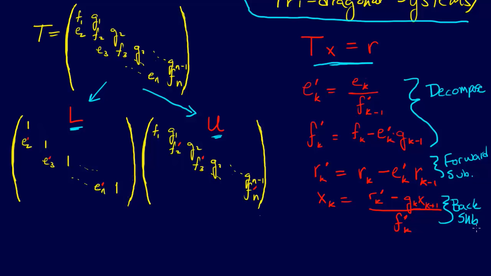

## LDU Decomposition

Saat kita melakukan dekomposisi $LU$, kita akan mendapatkan dua buah matriks $L$ dan $U$ yang masing-masing merupakan matriks segitiga bawah dan atas. Bila kita ingin menjadikan dekomposisinya menjadi $LDU$, dengan $D$ matriks diagonal yang bersesuaian, maka kita dapat melakukan pembagian baris pada matriks $U$ sesuai dengan entri pada diagonal utama matriks diagonal yang berkorespondensi dengan barisnya.

Perhatikan bahwa pada matriks simetris, maka dekomposisi ini menjadi $LDL^\intercal$. Proof-nya agak canggih (*sophisticated*). Kita bisa tahu:

- Cara mengetahui positive-definiteness (untuk semua vektor tak nol $\vec{x}$, berlaku $\vec{x}A\vec{x}^\intercal > 0$.

Tuliskan
$$
A = B^\intercal M B\\
A^\intercal = (B^\intercal M B) = A \iff A \text{ simetris}\\
x^\intercal Ax  = x^\intercal B^\intercal M B x = y^\intercal M y \ge 0
$$
Perhatikan bahwa $y$ itu merupakan Transformasi Linear. Perhatikan bahwa Jika diagonalnya positif definit, maka suatu matriks simetris juga. Selanjutnya perhatikan bahwa matriks diagonal dengan semua entri diagonalnya positif, maka nilai dari $xDx^\intercal$ nya ialah $\sum_{i = 1}^n x_i^2D_{i,i}$.

## More about Positive Definiteness Equality

I see there is a bit of confusion, so I'll try to explain better.

A matrix $A$ is positive semidefinite (p.sd.) if it is symmetric and all its eigenvalues are $\ge 0$.

A matrix $A$ is positive definite (p.d.) if it is symmetric and all its eigenvalues are $>0$.

This means that every p.d. matrix is also a p.sd. matrix. The set of positive semidefinite matrices **contains** the set of positive definite matrices, but there are some p.sd. matrices that are not p.d., like the matrix that has all elements equal to zero.

As an analogy, you can think about the real and integer numbers: all integer numbers are real numbers, because the set of real numbers contains the set of integer numbers, but there are real numbers, such as $\sqrt 2$ that are not integer.

The most common example is the identity matrix $I$: all its eigenvalues are $1>0$, so it is a p.d. matrix, but $1\ge 0$ so it is also a p.sd. matrix. This means that $I$ is a p.sd. matrix and it is invertible.

## Cholesky Decomposition

Membolehkan dekomposisi sebuah matriks $A = LL^\intercal \iff D$ nya itu merupakan matriks yang non-negatif (?)

Matriks yang tidak definit positif tidak memiliki cholesky decomposition. Karena pada dasarnya cholesky decomposition bisa didapatkan dari akar entri pada diagonal utamanya. Perhatikan bahwa

 ## Thomas Algorithm

LU Decomposition for Tri-Diagonal Systems

Misalkan ada sebuah matriks diagonal yang jika dan hanya jika selisih jarak manhattannya dari diagonalnya $\le 1$ yang boleh tidak $0$, sisanya mesti $0$.

Referensi: http://www.industrial-maths.com/ms6021_thomas.pdf

