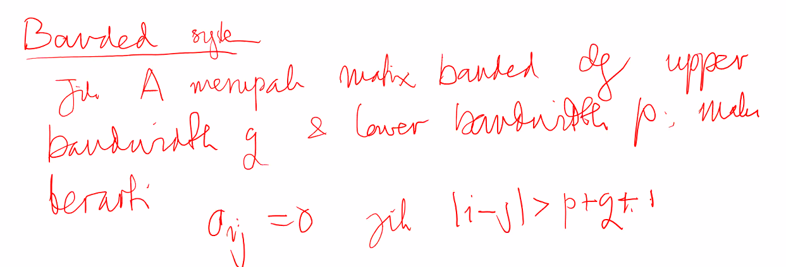

Recap

- $Ax = b$ dapat diselesaikan melalui dua cara.
  - Ubah A menjadi matrix segitiga atas $U$; $b$ harus disertakan dalam proses.
  - Faktorkan $A$ sehingga $A = LU$
- Cost $n^3/3$
- Perlu pivoting untuk menjamin bahwa proses dapat berjalan bila A non singular.
- Akurasi dari solusi yang kita peroleh, bergantung pada:
  - Machine epsilon
  - Condition number dari matriks $A$
  - Ukuran matrix, $n$. (Adanya propagasi error)

Apakah kita bisa melakukan cost yang lebih murah dalam mengerjakan permasalahan ini?

- Ada, matriks symmetric indefinite (Eigen valuenya bisa negatif)
- Symmetrice positive definite (Eigen valuenya semuanya positif)
- Banded

Eigenvalue akan menentukan arah dari transformasi linear.

Misal $A$ adalah suatu matriks symmetric. Terdapatlah $L$ matriks segitiga bawah satuan, $D$ matriks diagonal, sehingga $A = LDL^\intercal$.

Selama ini kita menyimpan $DL^\intercal$ dalam matriks $U$. Dalam faktorisasi $LU$. Namun faktorisasi $LU$ tidak simetris. $(LU)^\intercal = U^\intercal L^\intercal$. Saya hanya mencari $L$ dan $D$, elemen pada $L$, ada $\frac{n(n-1)}{2}$ elemen, matriks satuan, diagonalnya satu, serta $D$ yang ada $n$ elemen, sehingga totalnya ialah $\frac{n(n+1)}{2}$. Beda dengan faktorisasi $LU$ akan menghitung $n^2$ elemen. Biayanya setengah dari $LU$. Biaya dekomposisinya sekitar $\frac{n^3}{6}$.

```octave
function [L, D] = LDL(A)
  % A simetris
  [n, n] = size(A);

  % initialize  lower triangle matrix
  L = eye(n);

  for k=1:n-1
    for i=k+1:n
      % Find m untuk setiap baris i
      L(i, k) = A(k, i)/A(k, k);
      % Eliminasi baris i+1 .. n
      % A(i,:) = A(i,:) - L(i, k) * A(k,:);
      A(i,i:n) = A(i,i:n) - L(i,k) * A(k,i:n);
    endfor
  endfor

  D = diag(A);

endfunction
```

Diagonal Pivoting, searah dengan diagonal, ambil $\max(|a_{ii}|)$.
$$
\begin{bmatrix}
1 & 2 & 3\\
2 & 5 & 7\\
3 & 7 & 1
\end{bmatrix}
\leftrightarrow \text{Tukar baris 1 dan 2} \\
\begin{bmatrix}
2 & 5 & 7\\
1 & 2 & 3\\
3 & 7 & 1
\end{bmatrix}\leftrightarrow \text{Tukar kolom 1 dan 2}\\
\begin{bmatrix}
5 & 2 & 7\\
2 & 1 & 3\\
7 & 3 & 1
\end{bmatrix}
$$
Kelemahan diagonal Pivoting:
$$
\begin{bmatrix}
0 & 1 & 3\\
1 & 0 & 2\\
3 & 2 & 0
\end{bmatrix}
$$
Tidak bisa diapa-apakan bila ingin dilakukan diagonal pivoting. Perhatikan bahwa pertukaran hanya dapat dilakukan dengan menukarkan nilai nilai pada diagonal utama. Apabila diagonal utamanya bernilai $0$ semua, tidak ada yang bisa dilakukan diagonal pivoting. 

Jika $A$ adalah matriks simetris definite positive, maka terdapatlah matriks segitiga bawah $G$, sehingga $A = GG^\intercal$. Syarat definit positif:

- Semua eigen valuenya positif.
- Determinan dari main submatrix semuanya positive 

Bagaimana cara menemukan $G$? Cari $G_{ij}$ kolom demi kolom.

```octave
function [G] = Cholesky(A)
  % A is defined to be positive definite symmetric matrix;
  [n n] = size(A); 
  G = zeros(n, n);
  for k=1:n
    G(k, k) = sqrt(A(k,k) - sumsq(G(k,1:k-1)));
    for i=k+1:n
      G(i, k) = (A(i, k) - G(i,1:k-1) * G(k, 1:k-1)')/G(k, k);
    endfor
  endfor
  % Costnya sekitar n^3/6
endfunction
```





Jika A merupakan matrix banded dengan upper bandwidth $g$ dan lower bandwidth $p$, maka berarti $a_{ij} = 0$ jika $|i - j| > p + q$


Cholesky mahal karena ada square root, lebih baik bila tipis, gunakan dekomposisi $LDL^\intercal$.

Pelajari Vandermonde Matrix, Hermiditian, Two Plaids