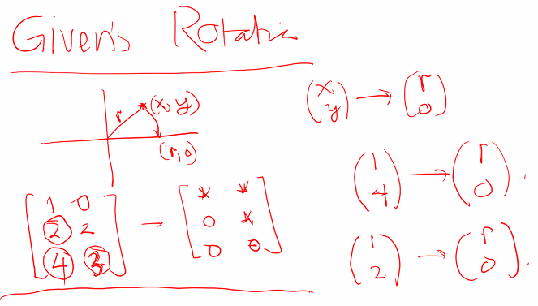

## Householder Algorithm

Idenya ialah diberikan input $A$ sebuah matriks dengan ukuran $m \times n$, serta sebuah vektor $b$, kemudian keluarkan $R$ dan $bt$, kita mesti lakukan zeroing terhadap $n$ kolom, loop paling luarnya akan ada $n$ iteration. 

Note:
$$
Hx =x - \frac{2v^\intercal x}{v^\intercal v}v
$$


```octave
function [R, bt] = myQR(A, b)
[m n] = size(A);
A = [A b];
for k=1:n
	% Ambil dari baris k sampai m saja, pada kolom ke-k
	e1 = zeros(m - k + 1, 1);
	e1(1) = 1;
  	v = A(k:m, k) + sign(A(k,k)) * norm(A(k:m,k)) * e1;
	alpha = 2/(v' * v);
	for j=k:n+1
		A(k:m, j)= A(k:m, j) - alpha * v' * A(k:m, j) * v;
	endfor
  R = A(:, 1:n);
  bt = A(:, n+1);
endfor
endfunction
```

## Given's Rotation

Perhaatikan bahwa ada suatu matriks rotasi yang bisa membawa dari $(x, y)$ menuju $(r, 0)$, bila kita ingin membawa dari suatu matriks $A$ menjadi suatu matriks berbentuk segitiga atas, berbentuk seperti $R$, maka masing-masing entri yang tidak termasuk ke bagian yang segitiga atas mesti dinol kan dengan menggunakan rotasi.



Perhatikan bahwa, harus dilakukan per kolom, tidak boleh kolom ke-$k+1$ dilakukan duluan karena saat meng-0kan kolom ke-$k$ nilai dari kolom ke-$k+1$ bisa muncul lagi nilainya. Ingat kembali sebuah matrix rotasi.
$$
J = \begin{bmatrix}
\cos \theta & \sin \theta\\
-\sin \theta & \cos \theta
\end{bmatrix}
$$
Perhatikan bahwa setiap prosesnya hanya akan dilakukan pada dua baris yang berkorespondensi. Perhatikan bahwa:
$$
r = \sqrt{x^2 + y^2}\\
\cos \theta = \frac{x}{r}\\
\sin \theta = \frac{y}{r}
$$
Bila kita ingin mengalikan:
$$
\begin{bmatrix}
c & s\\
-s & c
\end{bmatrix}
\begin{bmatrix}
	1 & 0\\
	2 & 2
\end{bmatrix}
$$
Perhatikan bahwa essentially, baris pertama = $c \times$baris pertama + $s \times$baris kedua. Perhatikan bahwa baris kedua = $-s\times$baris pertama + $c\times$baris kedua.

Algoritme:

- Cari non-zero pada kolom tersebut, kemudian gunakan diagonal utamanya.
- Cari $r$, dan $c$ dan $s$, kalikan baris yang bersesuaian.


Yang lebih besar harus menjadi pembagi agar nilainya kecil.

## Kasus $\text{rank}(A) < n$


$x_{LS}$ nya dinolkan saja agar normnya sekecil mungkin, karena dia ada $n-k$ kolom bergantung linear, maka solusinya jadi tak hingga, sehingga bisa diambil yang normnya yang paling kecil saja untuk solusi *least square solutionnya*.

Pivoting kolom untuk menempatkan $k$ variable yang independen di depan.

Cari kolom dengan $||||_2$ terbesar, tempatkan pada posisi kolom pertama.

Setelah selesai, maka selanjutnya kolom pertama dan baris pertama sudah 