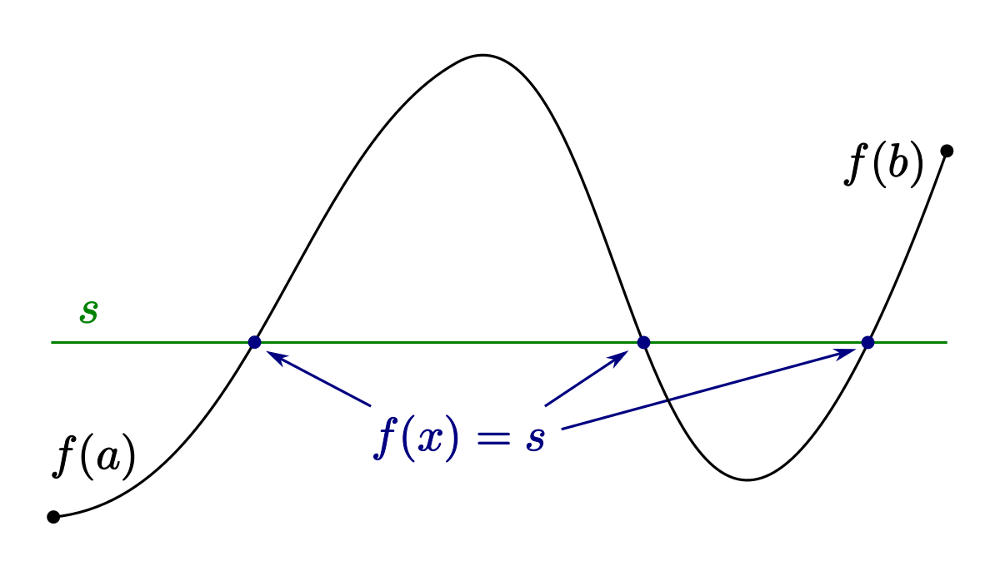
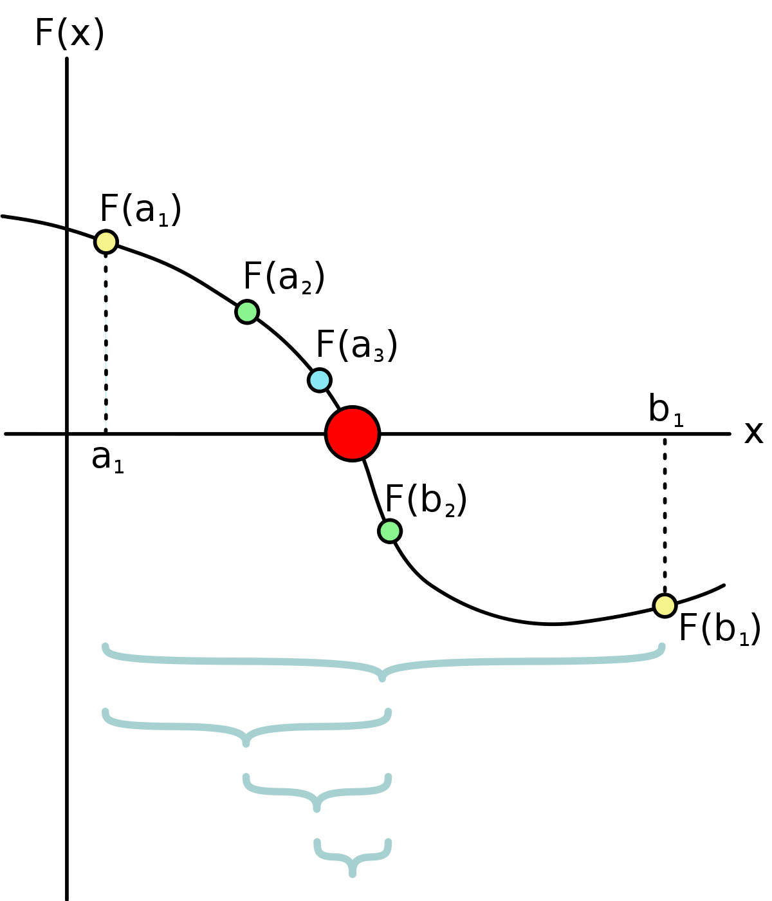
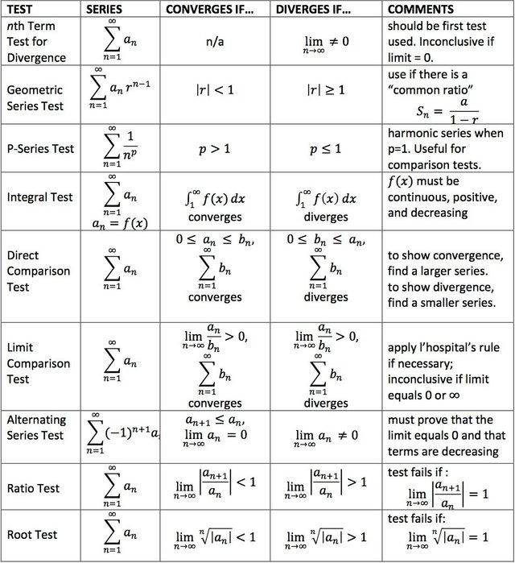

## Persamaan Non-Linear

Jika $f$ adalah suatu fungsi nonlinear, dicari $x$ dengan $f(x) = 0$, perhatikan bahwa domain $x \in \mathbb{R^n}$. kita ingin mencari akar-akar persamaannya.

### Eksistensi Solusi

- Solusi tidak selalu dijamin ada. Misalnya $x^2 + 2 = 0, x \in R$. Tidak ada $x$ sehingga $f(x) = 0$.
- Solusinya ada banyak $x^2 - 5x + 6 = 0$ ada $2$ solusi. Tapi $\sin(x) = \frac{1}{2}$ ada tak hingga banyak solusi.
- Solusinya bisa ada beberapa, tidak seperti persamaan linear yang hanya unik, tak hingga, dan tak konsisten. 

### Landasan Teori

Intermediate Value Theorem menyatakan bahwa suatu fungsi $f(x)$ kontinu pada $[a,b]$ dan $f(a)f(b) < 0 \implies$ terdapat $c \in [a, b]$ sehingga $f(c) = 0$.



### Galois Theory

Tidak ada algoritma yang dapat menyelesaikan persamaan non linear (*exactly*).

### Metode Iterative u/Mendekati solusi

Di bangkitkan suatu barisan $\{x_k\}$ yang konvergen ke solusi $f(x) = 0$. Misalkan $x^*$:
$\{x_k\} \to x^*$; $\lim_{k \to \infty} x_k = x^*$. Iterasi dihentikan ketika $x_k$ cukup dekat dengan $x^*$. Dari persamaan linear kita hanya *concern rounding error*. Tapi sekarang ada *truncational error*, tambahan error memotong solusi yang mestinya tak hingga menjadi hingga.

## Bi-Section Method

> *Binary search in disguise*

Misalnya syarat IVT dipenuhi, $f(a)f(b) < 0$.



Algoritma bi-section, dengan input $a, b$, dengan $f(a)f(b) < 0$. Akan dikembalikan nilai $x$, dengan $f(x) \approx 0$.

Stop when $(b-a) < \varepsilon$. Berapa kali iterasinya?

- 0th Iteration: $b - a$
- 1st Iteration: $\frac{b-a}{2}$
- $\vdots$
- k-th Iteration: $\frac{b-a}{2^k}$

Stop, jika
$$
\begin{aligned}
\frac{b-a}{2^n} &< ToL\\
n &> \log_2\frac{b-a}{ToL}\\
\implies n &= \text{ceil}(\log_2\frac{b-a}{ToL})
\end{aligned}
$$
Akurasi: Error estimator dengan backward difference. Relative error $x$ dengan $f(x)$.

Forward difference: $|\hat{x} - x^*| < ToL$

https://www.tutorialspoint.com/java/lang/math_nextafter_double.htm

Backward difference: $|f(x_n)|$

Cari $x$ yang memenuhi $\sin(x) = 0.3$ atau $\sin(x) - 0.3 = 0$.

## General Approach, Fixed Point Iterative Method

Misal $f(x) = 0$, dengan $x = g(x)$.

Contoh:

$x^2 - 5x + 6 =0$

- $x = \frac{x^2+6}{5}$.
- $x = \sqrt{5x-6}$.
- $x = -\sqrt{5x-6}$.

Lakukan iterasi berulang ulang

```octave
x = 2.4
for i=1:max_iter
	x = (x^2 + 6)/5;
endfor
```

Misal $x^*$ adalah solusi, dan $e_k  = x_k - x^*$, yang mengukur jarak dari calon solusi terhadap solusi eksak saya. Akan diperlukan $e_k \to 0$, agar $x_k$ konvergen.
$$
\begin{aligned}
e_{k + 1} &= x_{k + 1} - x^*\\ &= g(x_k) - x^*\\ &= g(x_k) - g(x^*)\\ &= g'(\theta) \cdot (x_k - x^*)
\end{aligned}
$$


Perhatikan bahwa rasio dia, turunannya mesti $< 1$. Agar dia konvergen.



<iframe width="560" height="315" src="https://www.youtube.com/embed/xa2vUsYJD-c" title="YouTube video player" frameborder="0" allow="accelerometer; autoplay; clipboard-write; encrypted-media; gyroscope; picture-in-picture" allowfullscreen></iframe>

<iframe width="560" height="315" src="https://www.youtube.com/embed/zyXRo8Qjj0A" title="YouTube video player" frameborder="0" allow="accelerometer; autoplay; clipboard-write; encrypted-media; gyroscope; picture-in-picture" allowfullscreen></iframe>

<iframe width="560" height="315" src="https://www.youtube.com/embed/zPDp_ewoyhM" title="YouTube video player" frameborder="0" allow="accelerometer; autoplay; clipboard-write; encrypted-media; gyroscope; picture-in-picture" allowfullscreen></iframe>

http://www.ltcconline.net/greenl/courses/105/applications/NEWT.HTM

http://www.cas.mcmaster.ca/~cs4te3/notes/newtons_method.pdf