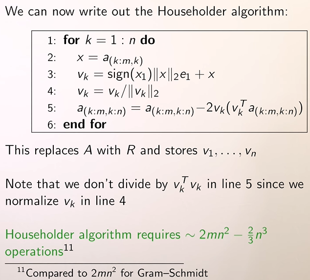

## Householder Transformation Steps

```octave
function [R, bt] = myQR(A, b)
[m n] = size(A);
A = [A b];
p = 1:n
for k=1:n
	% Ambil dari baris k sampai m saja, pada kolom ke-k
  	e1 = zeros(m - k + 1, 1);
	e1(1) = 1;
  	v = A(k:m, k) + sign(A(k,k)) * norm(A(k:m,k)) * e1;
	alpha = 2/(v' * v);
	for j=k:n+1
		A(k:m, j)= A(k:m, j) - alpha * v' * A(k:m, j) * v;
	endfor
  	R = A(:, 1:n);
  	bt = A(:, n+1);
endfor
endfunction
```

- Buatlah sebuah matriks $v$, sehingga matriks $w = \texttt{A(k:m, k)}$.
- Karena ada $\pm$, perhatikan bahwa dia ada dua pilihan. Perhatikan bahwa $v = ||w||e_1-w$


