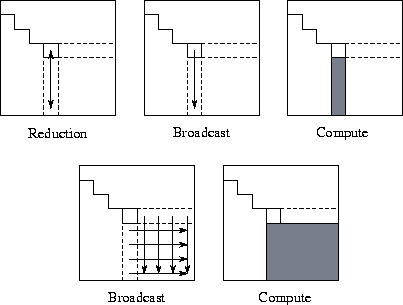

## QR Decomposition

Gram-Schmidt itu proses menjadikan sebuah matriks menjadi ortogonal tanpa merubah Ruang kolomnya. Perhatikan bahwa sekarang kolom-kolomnya merupakan basis ortogonal. 

Bila ingin menjadikannya basis ortonormal. Selanjutnya, kita bisa  scale sehingga setiap vektor kolomnya merupakan unit vektor. Ini yang kita gunakan sebagai $Q$ nya.

$QR$ Decomposition akan mentransformasi suatu matriks $A$ yang overdetermined menjadi dua buah matriks $Q$ dan $R$, perhatikan bahwa dalam kasus ini, matriks $Q$ merupakan matriks ortogonal, artinya matriks $Q$ memiliki kolom-kolom yang saling ortogonal, dan panjangnya 1.

## QR Decomposition Oldies

Misalkan kita mempunya matriks A seperti ini.

$$A = \begin{bmatrix}2 & 3\\ 2 & 4 \\ 1&1\end{bmatrix}$$

Kita ingin mendekomposisi A menjadi Q dan R, Q merupakan matrix ortonormal,  dan R ialah matriks segitiga atas. Pertama kita akan melakukan proses gram schmidt kepada matriks A.

$$
\vec{v}_1 = \begin{bmatrix}2 \\ 2 \\ 1\end{bmatrix}; \vec{v}_2 = \begin{bmatrix}3\\ 4 \\ 1\end{bmatrix}\\
$$

Process gram schmidt dilakukan untuk mencari matriks ortogonal dari matriks biasa. 

$$
\vec{u}_1 = \begin{bmatrix}2 \\ 2 \\ 1\end{bmatrix}\\
\begin{aligned}
\vec{u}_2 &= \vec{v}_2-\text{Proj}_{\vec{u}_1}(\vec{v}_2) \\&= \begin{bmatrix}3\\ 4 \\ 1\end{bmatrix} - \frac{6+8+1}{\sqrt{4+4+1}^2} \begin{bmatrix}3\\ 4 \\ 1\end{bmatrix}
\\ &= \begin{bmatrix}3\\ 4 \\ 1\end{bmatrix} - \frac{15}{9} \begin{bmatrix}2\\ 2 \\ 1\end{bmatrix} \\ &= \begin{bmatrix}3\\ 4 \\ 1\end{bmatrix} - \begin{bmatrix}\frac{10}{3}\\ \frac{10}{3} \\ \frac{5}{3}\end{bmatrix} \\  &= \begin{bmatrix}-\frac{1}{3}\\ \frac{2}{3} \\ -\frac{2}{3}\end{bmatrix} \\
\end{aligned}
$$

Setelah kita melakukan ortonormalisasi vektor-vektor kolomnya, dapat ditulis:

$$
Q = \begin{bmatrix}\frac{2}{3} & -\frac{1}{3}\\ \frac{2}{3} & \frac{2}{3} \\ \frac{1}{3} & -\frac{2}{3}\end{bmatrix}
\\
\begin{aligned}
A &= QR\\
Q^T A &= Q^T Q R\\
Q^T A &= IR &= R\\
R &= Q^T A
\end{aligned}
$$

Perhatikan bahwa matriks R ialah matriks segitiga atas. Mengapa? karena perhatikan bahwa $Q^T$ baris-barisnya tegak lurus dengan kolom kolom dengan indeks yang lebih besar pada A, dari proses gram schmidt kita ketahui bahwa matriks Q diturunkan dari A, sehingga pasti kolom ke i dari Q ortogonal dengan kolom ke j dari A, di mana j < i

Ini berguna saat kita ingin mencari LSS, dari A**x** = [7;3;1].

Solusinya dapat ditulis kira-kira dengan persamaan berikut.

$$
\begin{aligned}
A^TA\vec{x} &= A^T\vec{b} \\
(QR)^T(QR)\vec{x} &= (QR)^T\vec{b} \\
R^TQ^TQR\vec{x} &= R^TQ^T\vec{b} \\
R\vec{x} &= Q^T\vec{b}
\end{aligned}
$$

## Householder Transformation

Ingat kembali gaussian elimination

## Householder Triangularization

Secara numerik, perhatikan bahwa Householder ini lebih stabil dan efisien. Idenya ialah kita mengalikan matriks ortogonal secara beruntuk, ke A, sehingga menghasilkan R.

$Q_n, \dots, Q_2, Q_1A = R$

Pada tahun 1958, Householder menemukan cara untuk membuat hal tersebut bisa. Cara kerjanya mirip $LU$ decomposition, tapi mesti ortogonal. Kita bisa menggunakan yang namanya Householder Reflector.

Kita pilih
$$
Q_k = \begin{bmatrix} I & 0 \\ 0 & F\end{bmatrix}
$$
Dengan $I$ adalah suatu matriks persegi berukuran $k-1$ dan $F$ ialah matriks persegi berukuran $m-k+1$ yang disebut sebagai Householder Reflector.

$I$ ini memastikan bahwa baris $k-1$ pertama tidak berubah. F mestinya orthogonal, yang mengimplikasikan $Q_k$ ortogonal.

Misalkan $x$ merupakan vektor berukuran $m-k+1$, yang mengindikasikan entri dari $k, \dots, m$ dari kolom ke-$k$.

